## 1. Introduction
### 1-1. 프로그래밍이란 무엇인가?
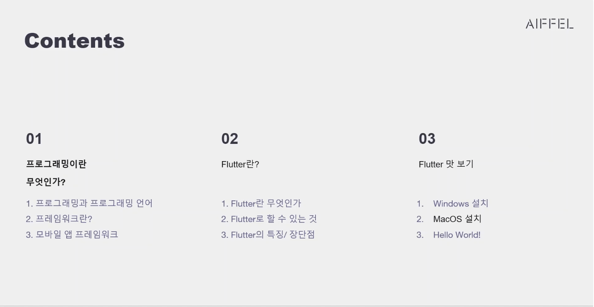
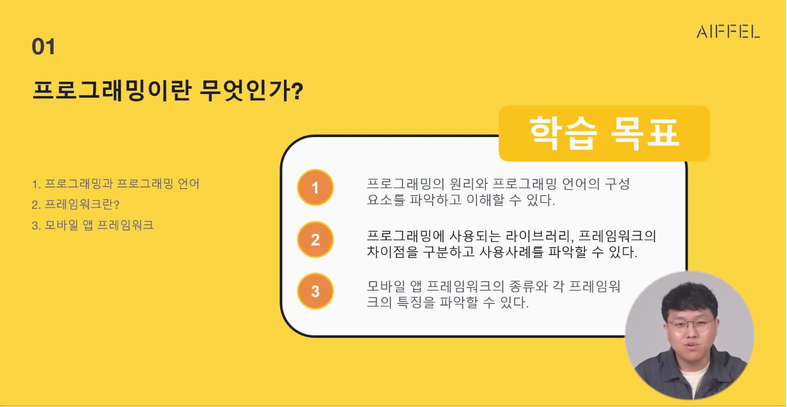

#### 프로그래밍과 프로그래밍 언어 1
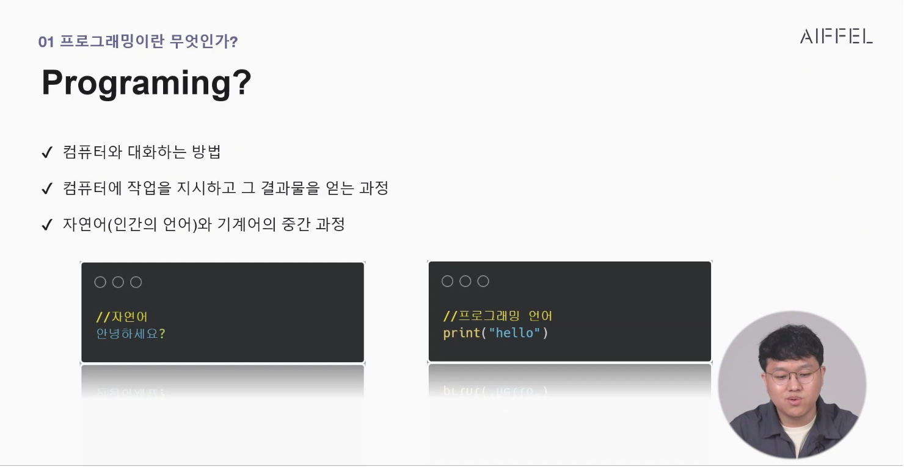
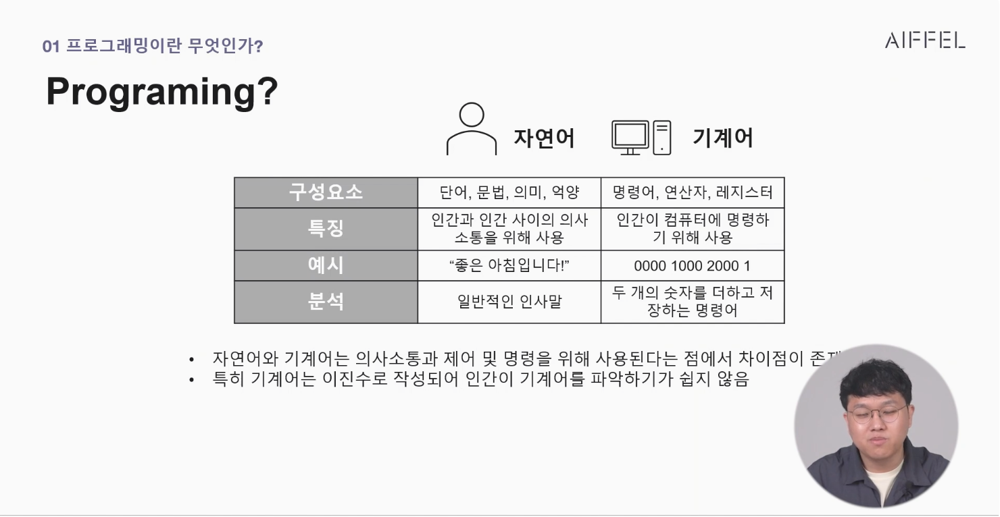 
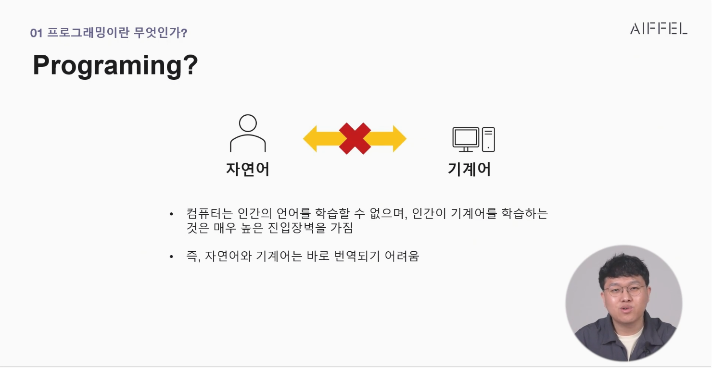
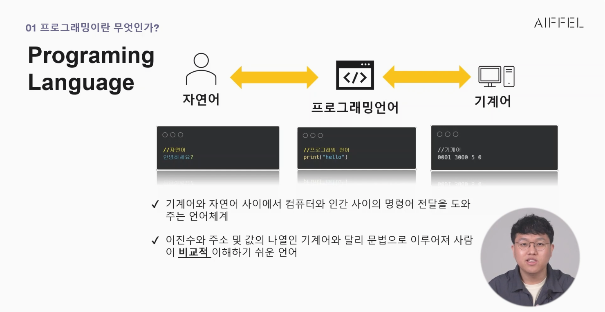
사람이 이해하기 쉬운 중간 언어단계로 존재하는것이 프로그래밍 언어
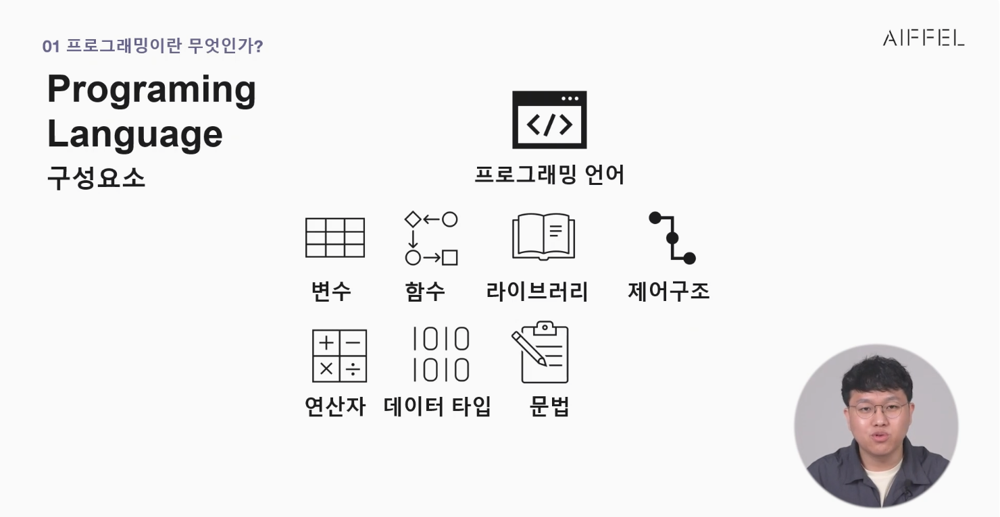
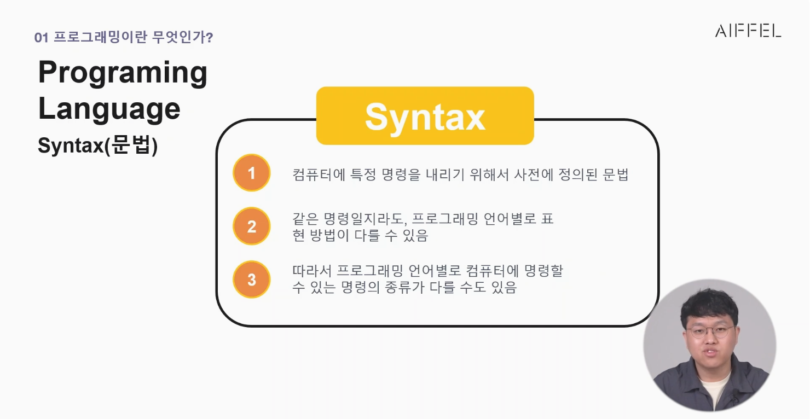
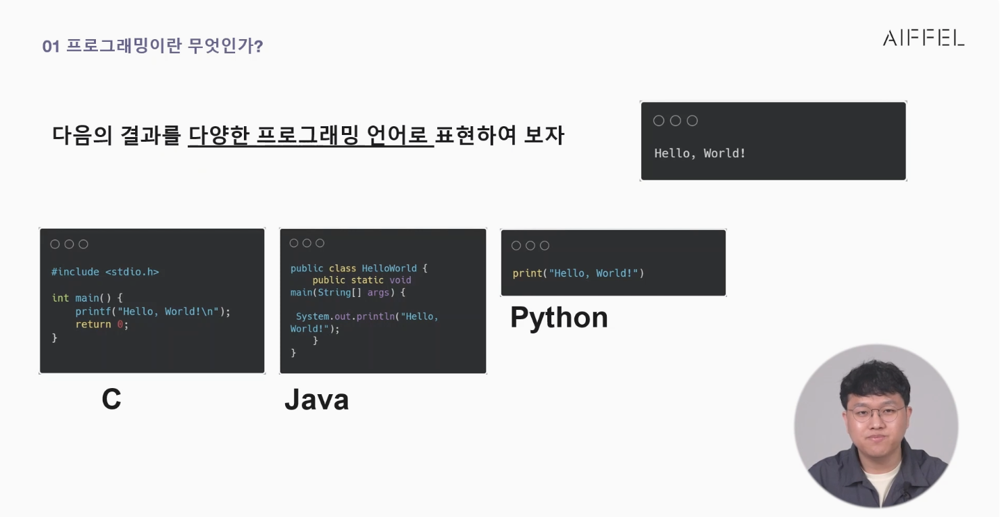
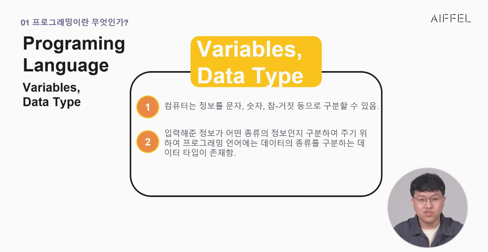
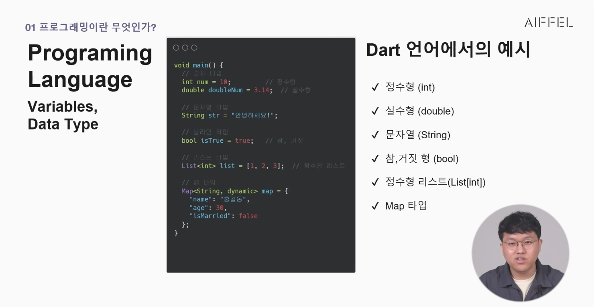
---
### 학습 내용
1. 프로그래밍이란 무엇인가?
 - 프로그래밍과 프로그래밍 언어
 - 프레임워크란?
 - 모바일 앱 프레임워크
2. Flutter란?
 - Flutter란 무엇인가
 - Flutter로 할 수 있는 것
 - Flutter의 특징/ 장단점
3. Flutter 맛 보기
 - Windows 설치
 - MacOS 설치
 - Hello World!

---
### [노트 1] 프로그래밍과 프로그래밍 언어 1

---

Programing이란?
프로그래밍이란 쉽게 말해 인간이 컴퓨터와 대화하는 방법입니다. 컴퓨터에 작업을 지시하고 그 결과물을 얻는 과정입니다. 자연어(인간의 언어)와 기계어의 중간 과정이라고 생각할 수 있습니다.

기계어는 이진수로 작성되어 인간이 기계어를 파악하기란 쉽지 않고, 맥락과 의미 억양 등 복잡도가 높은 자연어를 기계어로 바로 번역하기는 매우 어렵습니다. 이때 기계어와 자연어 사이에서 컴퓨터와 인간 사이의 명령어 전달을 도와주는 언어체계가 바로 프로그래밍 언어입니다.

content img
프로그래밍 언어의 구성요소 - 문법(Syntax)
컴퓨터에 특정 명령을 내리기 위해서 프로그래밍 언어에 사전에 정의된 문법이 존재합니다. 같은 명령일지라도, 프로그래밍 언어별로 표현 방법이 다를 수 있습니다.

프로그래밍 언어의 구성요소 - 변수(Variables), 데이터 타입(Data Type)
변수는 값을 저장하고 참조하기 위해 사용되는 이름이나 식별자입니다. 이때 컴퓨터와 소통하기 위해서는 값의 종류를 구분해서 입력해 줘야 하는데요. 이 종류를 데이터 타입이라고 합니다. 데이터 타입은 프로그래밍 언어마다 약간 차이점이 있을 수 있습니다. 예를 들면 Dart 언어에는 데이터타입으로 정수형(Int), 실수형(Double), 문자열(String), 참거짓형(Bool), 정수형 리스트(List[int]), Map 타입이 존재합니다.

---
[노트 2] 프로그래밍과 프로그래밍 언어 2
프로그래밍 언어의 구성요소 - 제어구조(Control Flow), 연산자(Operator)
프로그래밍 언어는 분기점들을 처리하는 하나의 흐름이라고 볼 수 있고, 이를 위해 제어구조와 연산자가 존재합니다.

Dart 언어에서는 다음의 제어구조가 존재합니다.

✔️ if - else

✔️ do - while

✔️ while

✔️ for

✔️ switch - case

---
✔️ break - continue

✔️ assert

Dart 언어에서는 다음의 연산자가 존재합니다.

✔️ Arithmetic operators (+, -, *, / )

✔️ Equality and relational operators (==, !=)

✔️ Type test operators (as, is, is! )

✔️ Assignment operators ( =, +=, *= )

✔️ Logical operators (&&, || )

✔️ Conditional expressions (? :, ?? :)

---
### 프로그래밍 언어의 구성요소 - 라이브러리(Library)

---
라이브러리란 재사용 가능한 코드와 기능의 집합입니다. 라이브러리 호출을 통해 개발에 사용되는 시간을 줄이고 더 유용한 기능을 개발하는데 시간을 집중할 수 있습니다.

pub.dev 사이트는 Flutter 및 일반 Dart 프로그램을 위한 라이브러리 및 패키지를 포함하는 Dart 프로그래밍 언어용 패키지 관리자입니다.

---
### 1-2. Flutter란?
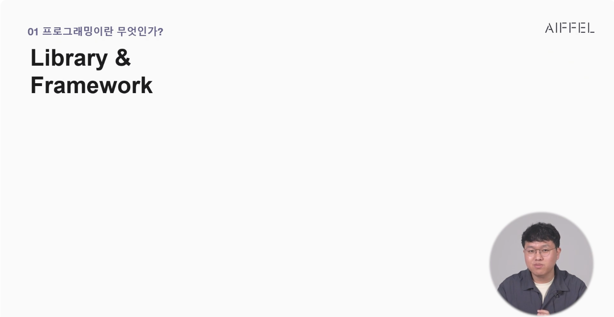
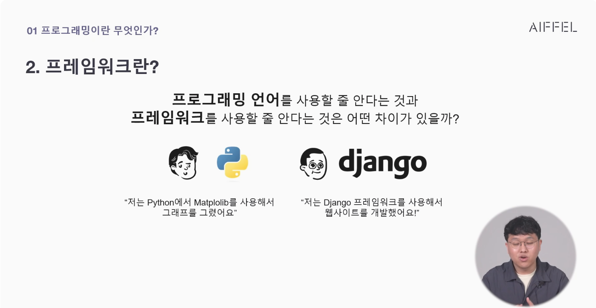
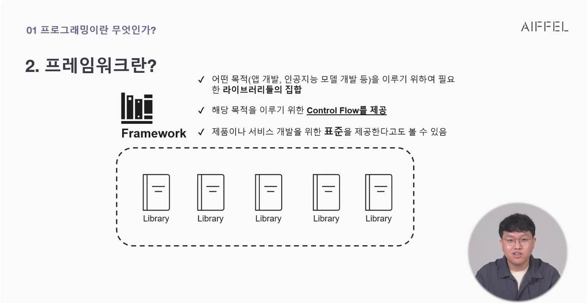

프레임워크는 라이브러리가 단순히 어떤 기능을 다시 만들지 않기 위해 만든다면 프레임워크는 어떤 목적(앱 개발, 인공지능 개발 )을 이루기 위해 필요한 라이브러리와 기능,코드들의 집합을 프레임워크라고 함

프레임워크의 가장 중요한 점은 그 목적을 위한 Control Flow(제품이나 서비스 제공위한 표준) 제공

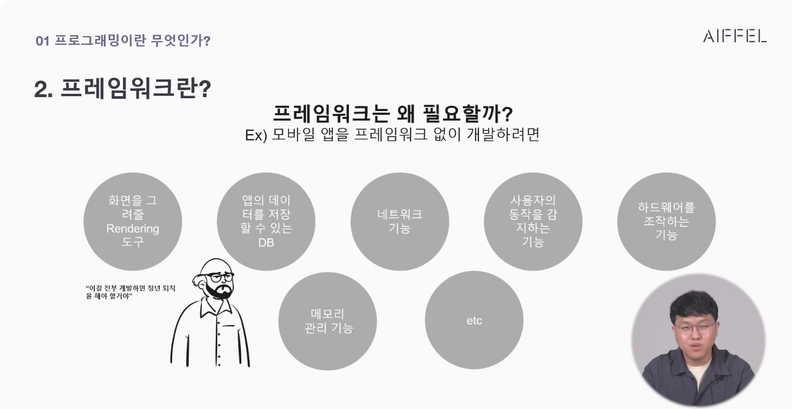
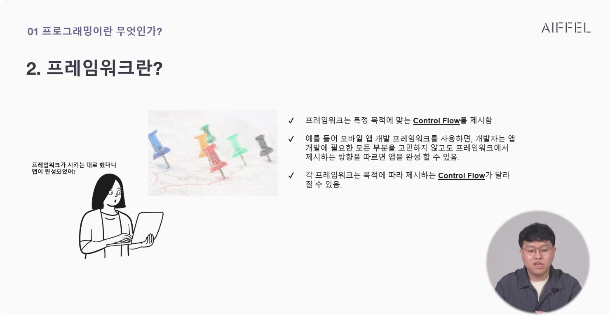
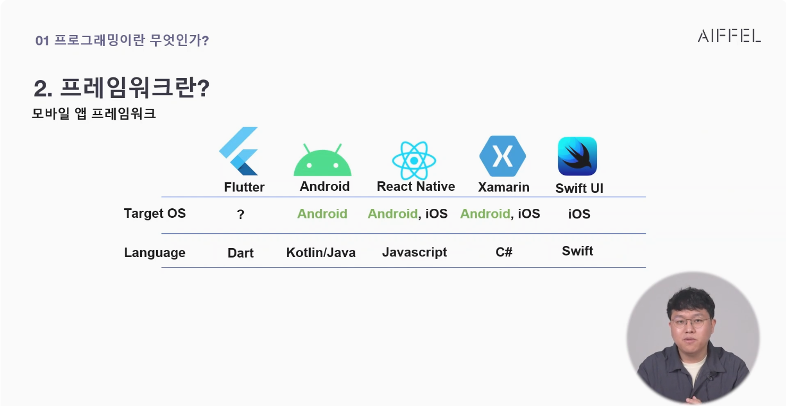
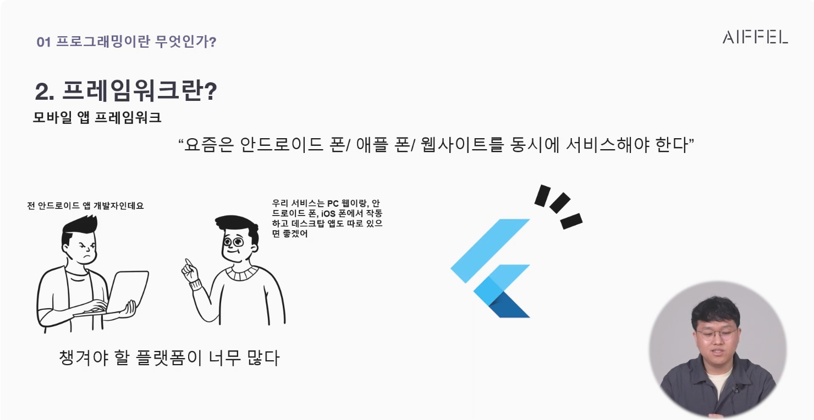

---
#### [노트 1] Flutter란? 1

프레임워크란?

프레임워크란 앞서 설명드렸던 라이브러리와 같이 재사용 가능한 코드와 기능의 집합입니다. 프레임워크만의 특징은 어떤 목적(어플리케이션의 개발 등)을 이루기 위해 개발자에게 제공되는 뼈대라는 점입니다. 이를 위해 프레임워크에는 Control Flow가 제공되며 이는 제품이나 서비스 개발을 위한 표준을 제공한다고 볼 수 있습니다.

다음 이미지는 현재 시중에 널리 쓰이고 있는 모바일 앱 프레임워크를 보여줍니다.

위 이미지에서 Flutter의 Target OS는 '?'로 나와있죠. 이 부분이 Flutter의 큰 장점입니다. 자세한 사항은 추후 학습하며 살펴보겠습니다.

---
[영상 2] Flutter란? 2

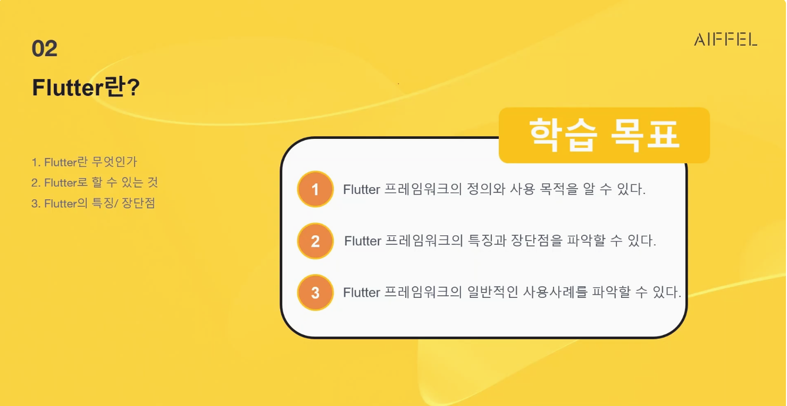
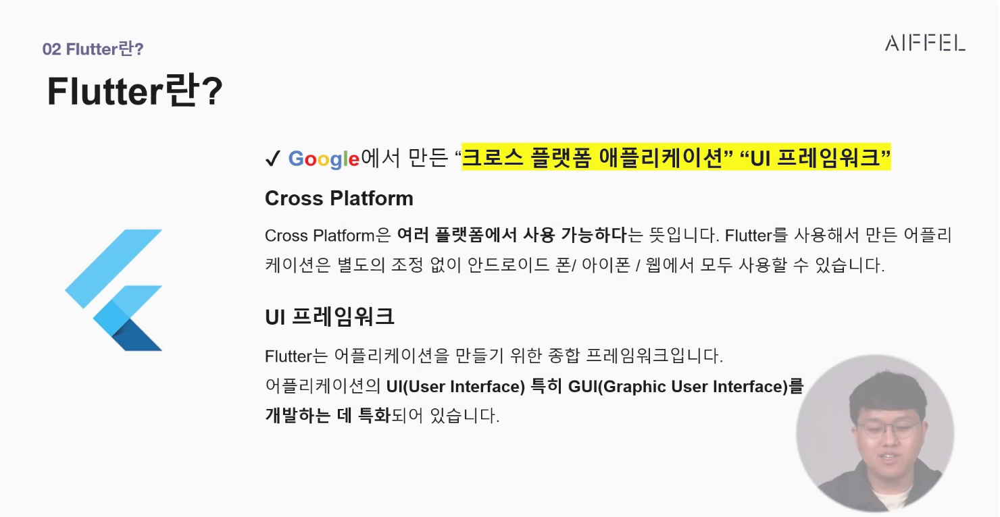

UI는 텍스트입력, 버튼 클릭, 화면스와이프 등을 의미함

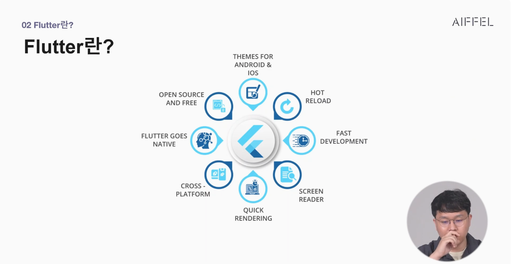
플러터는 기본적으로 안드로이드에서 사용하는 머티리얼과 아이폰에서 사용하는 쿠퍼티노를 지원함. 플루언트라는 데스크톱 디자인도 채용

핫리로드 : 코드를 수정하면 바로바로 적용되는 기능

플러터의 경우 스키아 그래픽엔진이 화면을 그려줌. 오픈소스로 무료 사용가능

플러터는 네이티브는 아님(하드웨어 구동시 네이티브를 불러와서 사용함)

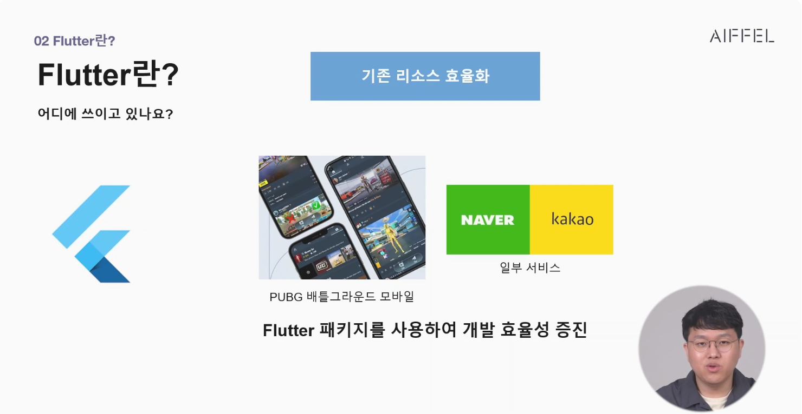

플러터는 기존 리소스를 효율적으로 사용하기 위해 플러터 활용
(어떤 서비스가 안드로이드와 스위프트 양쪽에서 똑같이 사용하는 부분에 대해서는 플러터를 이용해 2번 개발하지 않고 플러터 사용함)

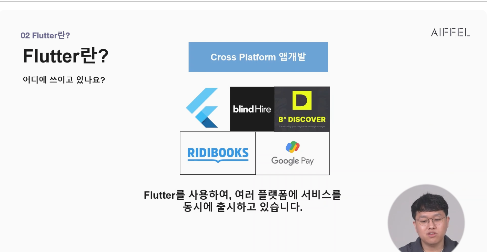
빠르게 학습해서 만드는 것이 가능함.

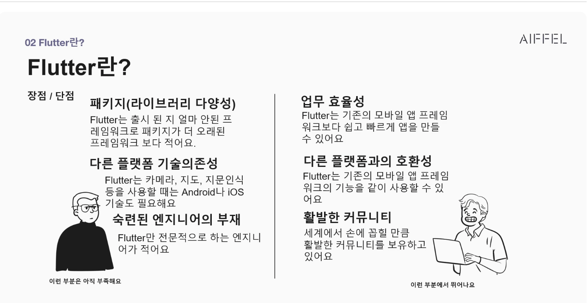

---

[노트 2] Flutter란? 2
Flutter란?
Flutter란 구글에서 만든 '크로스 플랫폼 어플리케이션'이며, 'UI 프레임워크'입니다. 여기서 크로스 플랫폼이란 여러 플랫폼에서 사용 가능하다는 뜻입니다. Flutter를 사용해서 만든 어플리케이션은 별도의 조정 없이 안드로이드 폰, 아이폰, 웹 에서 모두 사용할 수 있습니다. UI 프레임워크란 어플리케이션을 만들기 위한 종합 프레임워크이며, UI(User Interface) 특히 GUI(Graphic User Interface)를 개발하는 데 특화되어 있습니다.

[종합퀴즈]
① 조건의 참/거짓에 따라 분기가 나뉘는 제어구조(Control Flow)는 무엇일까요?
② 라이브러리와 프레임워크의 차이점은 무엇인가요?
① if-else 구문입니다.
② 라이브러리는 개발자가 필요한 기능을 가져와 사용할 수 있는 도구 모음이고, 프레임워크는 개발자에게 구조와 규칙을 제공하여 애플리케이션을 개발할 수 있는 플랫폼입니다. 둘 다 재사용 가능한 코드와 기능의 집합이지만, 프레임워크만의 특징은 어떤 목적(어플리케이션의 개발 등)을 이루기 위해 개발자에게 제공되는 뼈대라는 점입니다.

---
### 1-4. MacOS 설치
[노트 1] MacOS 설치 1
본 노트는 간략한 요약입니다. 자세한 설치 절차는 영상을 따라하며 확인하시길 바랍니다.

✔️ Flutter를 설치합니다. (https://docs.flutter.dev/get-started/install/macos)
✔️ 영상의 안내에 따라 환경변수(PATH Variable)를 업데이트합니다.
✔️ Homebrew를 설치합니다. (https://brew.sh/index_ko)
✔️ cocoapods를 설치합니다. (https://formulae.brew.sh/formula/cocoapods)
✔️ Visual Studio Code를 설치합니다. (공식 설치 링크)
✔️ Android Studio를 설치합니다. (https://formulae.brew.sh/cask/android-studio)

---
본 노트는 간략한 요약입니다. 자세한 설치 절차는 영상을 따라하며 확인하시길 바랍니다.

✔️ Xcode를 설치합니다. (공식 설치 링크)
✔️ 터미널(Terminal)에 'flutter doctor' 명령어를 실행하여 Flutter의 정상 설치 여부를 확인합니다.
✔️ Visual Studio Code 에서 다음 Extensions를 설치합니다.

-Dart

-Error Lens

-Flutter

-Flutter Tree

-Material Icon Theme

-Pubspec Assist

