#### [영상 1] Flutter Inside 1

---
Material / Cupertino : 디자인 시스템. 구글과 애플이 지향하는 디자인을 담아놓음

Widget : UI를 구성하는 요소. 모든 것이 Widget. 

Rendering : Widget을 화면에 그리는 것.

Animation : Widget의 애니메이션을 처리하는 것.

Painting : Widget 색칠하는것

Gestures : Widget의 터치 이벤트를 처리하는 것.

Foundation : Widget의 앱의 기반을 담당하는 것.

---
플러터는 선언형 UI

선언형 UI는 원하는 결과물을 설명하는 방식으로 사용자 인터페이스를 정의

모든 UI요소를 위젯으로 표현

UI 선언부에 UI 모양과 생상을 전부 선언 가능함

UI 선언과 제어가 전부 동일한 언어로 작성됨

상태 변경 시 자동으로 화면이 갱신

코드의 읽기성과 유지보수성이 좋음

예시: React, Flutter, Vue.js 등

---

명령형UI : html(구조), css(스타일), javascript(동작)으로 구현하는 방식

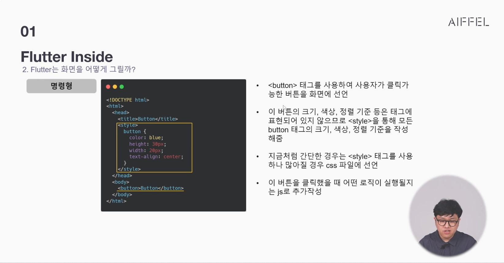
명령형 UI 장점은 분리작업이 가능하다(퍼블리셔와 프론트엔드 엔지니어)

---
명령형UI는 단계별로 작업을 직접 기술하여 사용자 인터페이스를 구축
 - 개발자가 화면에 대한 모든 조작 및 동작을 명시적으로 작성

개발자는 각 단계별로 필요한 동작과 조작을 직접 제어

화면 업데이트나 상태 변화에 대한 관리가 수동적으로 이루어짐

한가지 언어로 전부 표현하는 것은 불가능

예시: jQuery, Vanilla JavaScript 등

---
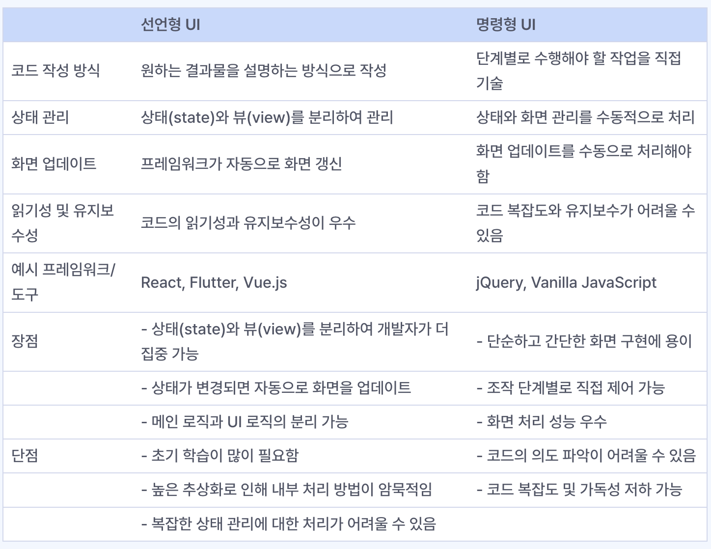

---

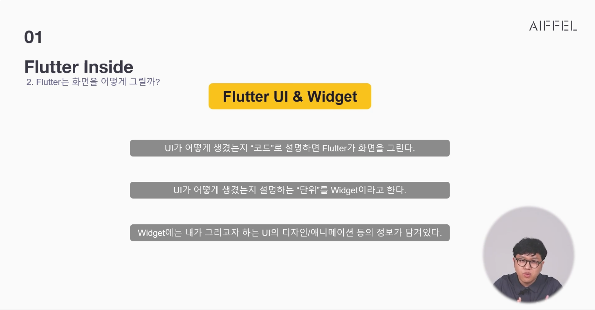
UI를 구성하는 모든 것이 Widget이다. Widget을 잘 다루는 것이 플러터의 핵심

---
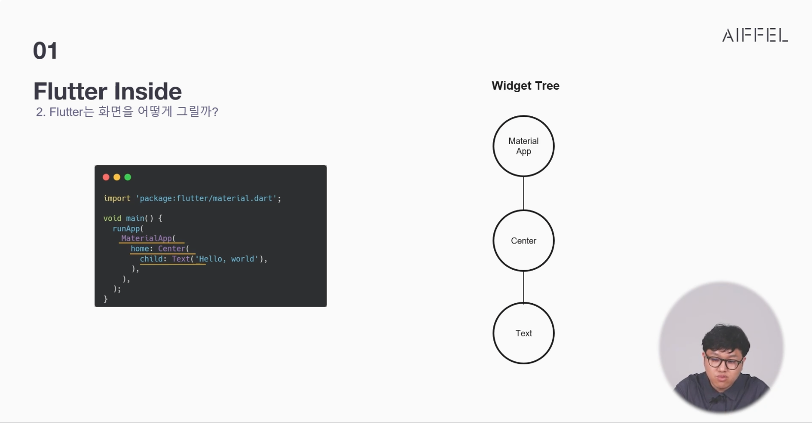
Widget은 트리 형태로 구성이 된다. 트리를 쌓아가는것이 위젯을 구성하는 방법

---

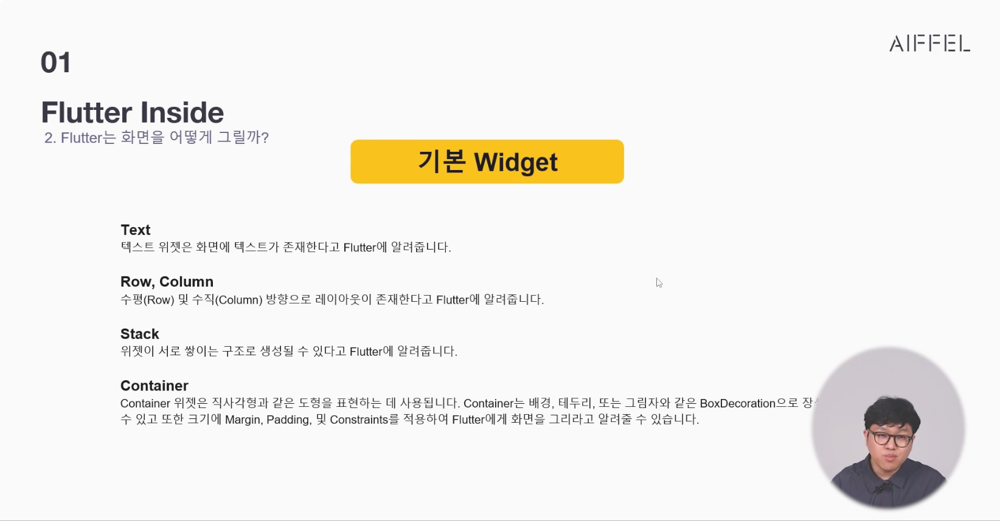
컨테이너는 투명한 도형. 
박스단위로 구성이 되며 다른 것을 포장해주는 가장 작은 단위. 

---
witget 정리  
화면을 그리는데 필요한 최소한의 단위로 
Widget은 UI에서 재사용 가능한 구성 요소

 Widget은 버튼, 텍스트 상자, 드롭다운 목록, 체크박스, 슬라이더 등과 같은 다양한 UI 요소를 나타낼 수 있습니다. 

기본적인 Widget의 요소

Text : 텍스트 Widget은 화면에 텍스트가 존재한다고 Flutter에 알려줍니다.

Row, Column : 수평(Row) 및 수직(Column) 방향으로 레이아웃이 존재한다고 Flutter에 알려줍니다.

---

Stack : Widget이 서로 쌓이는 구조로 생성될 수 있다고 Flutter에 알려줍니다.

Container : Container Widget은 직사각형과 같은 도형을 표현하는 데 사용됩니다. Container는 배경, 테두리, 또는 그림자와 같은 BoxDecoration으로 장식할 수 있고 또한 크기에 Margin, Padding, 및 Constraints를 적용하여 Flutter에게 화면을 그리라고 알려줄 수 있습니다.

---
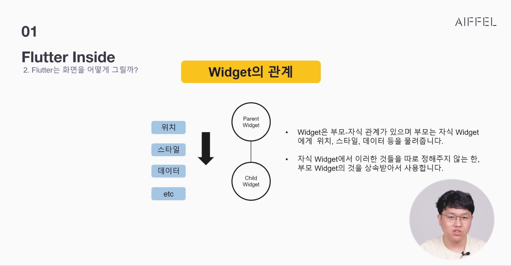
가장 위 부모 트리가 있고 밑에 자식 트리가 있다. 

#### state
우리가 알고 있는 상태라는 의미외 다른 개념을 추가해 이해해야 한다.

---

유저의 액션에 의해 변화하는 정보를 어딘가에 저장해야 한다. 서버나 데이터 베이스의 경우 응답속도가 느리기 때문에 state를 사용한다.

---

---
일부 변경 수정되는 정보는 그 변경과 수정을 추적하고 UI에 반영해야 한다. 어플리케이션에 메모리가 있고 그 메모리에 저장된 정보가 추적되고 UI에 반영되어야 한다.
state를 관리하는것은 UI에 표시되는 것을 관리하는 것도 있지만 state에 많은 정보가 담겨있을 경우 어플리케이션의 메모리 사용량도 늘어난다.
state에 담겨 있는 정보를 UI에 표현되는 데이터 관리하고 정리하고 추적하고 메모리관리까지 생각해야 하는 것이 state management이다.

---

---
state management는 UI가 다시 새로운 화면으로 그려지기 위해서 사용자에게 이벤트나 액션으로 받은 정보들, 클릭, QR등의 정보가 입력된 정보들이 UI에 어떻게 표현되어야 하는지에 대한 데이터를 기록해둔 그리고 그데이터를 메모리에 쌓아둔것이 state

---
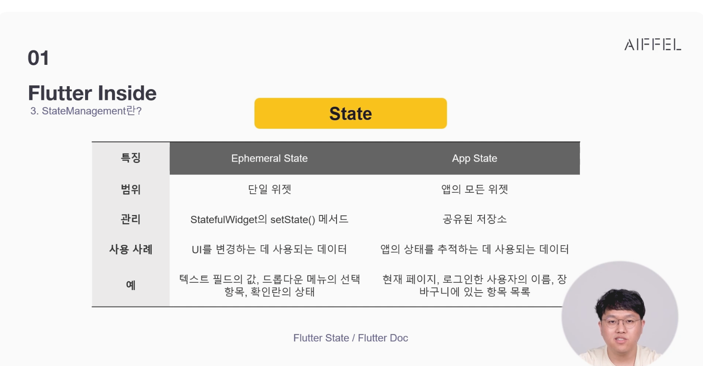

---
ephemeral state

임시 상태는 단일 위젯 안에 포함할 수 있는 상태입니다. 또는 local state라고 부르기도 합니다.
임시 상태는 상태 관리 라이브러리를 사용할 필요가 없고 statefulWidget만 있으면 됩니다

---
앱에서 여러 데이터를 공유하고 유지하려는 상태를 application state라고 합니다.

 

예를 들어 앱으로 옷을 구매할 때 카테고리 별로 나눠져 있습니다. 모자, 상의, 하의, 신발, 등등으로 말입니다. 그리고 사용자들은 자신이 원하는 상품 카테고리에 들어가 상품을 장바구니에 넣습니다. 이 경우 상품들을 볼 수 있는 페이지는 따로 있을 것이고 장바구니 페이지도 따로 있을 것입니다. 만약에 임시 상태로 장바구니를 만들어 놓게 된다면 장바구니 페이지를 열 때마다 장바구니는 비어져 있을 것입니다. 그래서 사용자가 장바구니에 담은 데이터를 앱 전체에서 사용할 수 있는 상태가 필요합니다.

 

그래서 필요한 것이 상태 관리 라이브러리 입니다. Flutter홈페이지 에서는 Provider를 권장

---

---
single widget : 하나의 위젯이 하나의 state를 가지고 있을 경우 ephemeral state 사용
multi widget : 여러개의 위젯이 하나의 state를 가지고 있을 경우 app state 사용

---
### 3-2. Flutter Layout & Animation

#### [영상 1] Flutter Layout & Animation 1

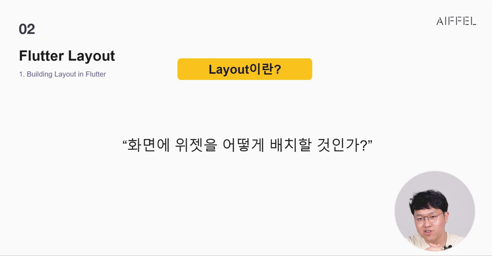
Layout : UI를 구성하는 요소들을 배치하는 것

---

---
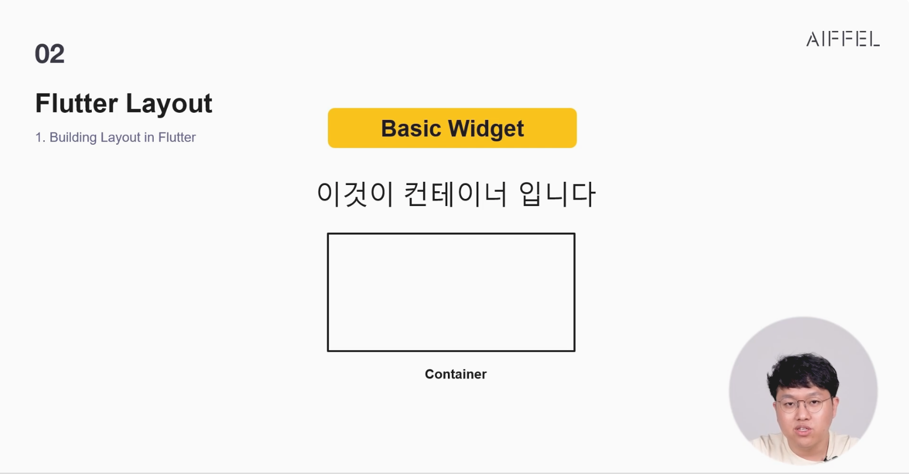
투명한 직사각형 상자를 어떻게 구성하는, 어떻게 공간을 채워나가는가를 고민하는 것이 Layout

---

Padding / Margin : 컨테이너 안에 보이지 않는 공간을 설정하는 것
Padding : 요소 안쪽에 자식위젯을 가졌을때 자식과 부모 사이 거리
Margin : 컨테이너 사이의 거리
Alignment : 2D의 경우 9개의 구역을 가지고 정렬을 시킬 수 있다. ex) center, top, bottom, left, right, top left, top right, bottom left, bottom right

---

부모 위젯의 사이즈를 결정하지 않으면 자식위젯이 꽉 채워버린다.

---

Constraint(제약) : 제약이 없으면 자식위젯이 부모위젯과 동일한 크기까지 커진다. 부모 위젯은 자식 위젯에게 제약 사항을 내린다. 자식 위젯은 부모 위젯의 제약 사항을 받아서 그 안에서 자신의 크기를 결정한다.

---
### [영상 3] Flutter Layout & Animation 3

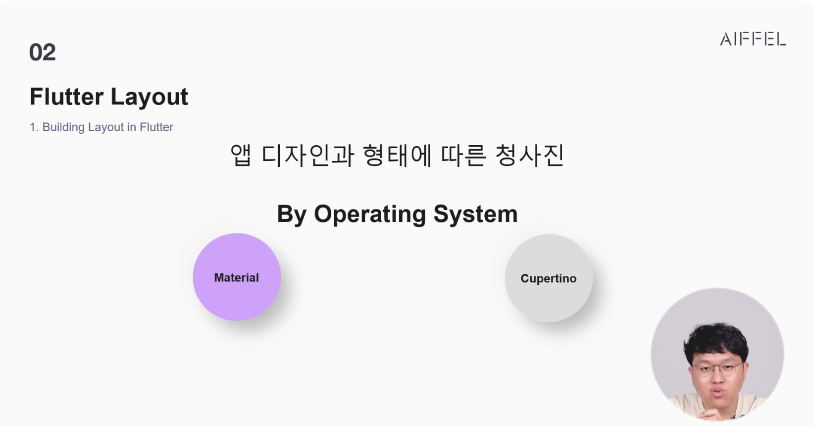
운영체제에 맞게 가장최적화된 디자인을 미리 구성

---

---

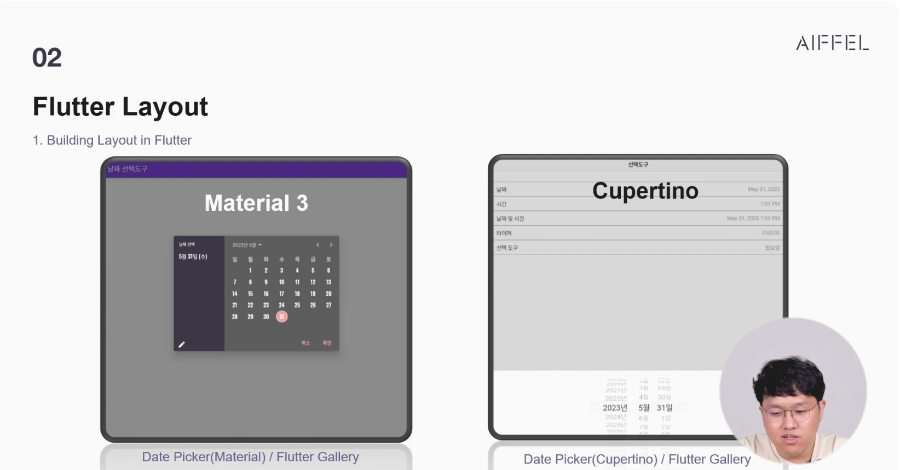
Material3 vs Cupertino
디자인을 불러올때 시스템 UI를 불러오게 되면 디자인을 준수하지 않으면 구현이 되지 않을수 있다.

---
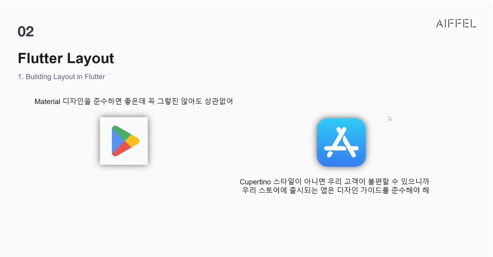

---

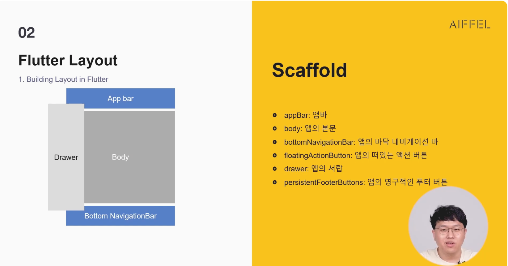

---
스캐폴드는 앱의 기본적인 뼈대를 만들어주는 위젯이다. 앱바, 바디, Bottom Navi, Drawer를 가지고 있다.
스캐폴드가 Parent 위젯이고 그 안에 자식 위젯들에게 물려준다.
appbar : 앱바는 앱의 상단에 위치하며, 앱의 타이틀이나 메뉴 버튼 등을 포함할 수 있습니다.
body : 앱의 메인 콘텐츠를 포함하는 영역입니다.
bottomNavigationBar : 앱의 하단에 위치하며, 탭을 통해 다른 화면으로 이동할 수 있는 탭바를 포함할 수 있습니다.
drawer : 앱의 좌측에 위치하며, 메뉴를 포함할 수 있습니다.

---

---

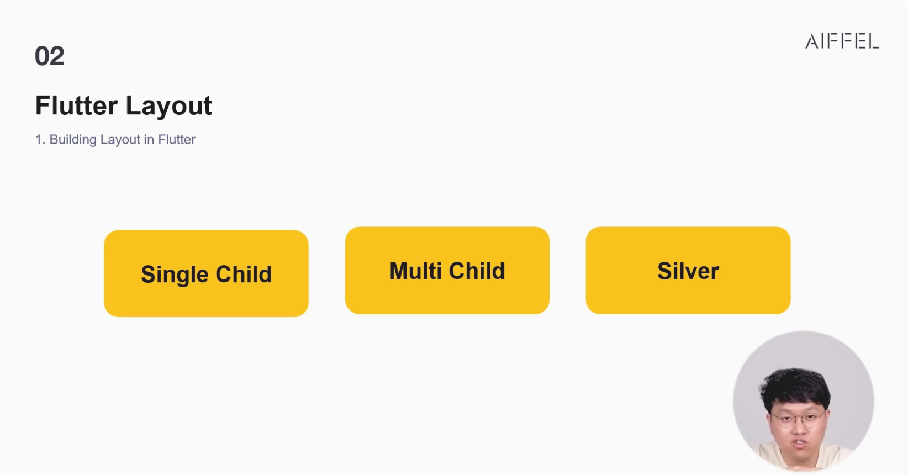

---

Single Child, Multi Child, Silver는 위젯의 자식(Children) 구성을 다루는 방식을 나타내는 용어입니다.

Single Child: 하나의 자식 위젯만을 가지는 위젯입니다. (일자로 하나의 트리로 구성) 주로 하나의 위젯을 정렬하거나 크기를 조정하는 데 사용됩니다. 

Multi Child: 여러 개의 자식 위젯을 가질 수 있는 위젯입니다. 주로 여러 위젯을 배열하고 정렬하여 구성합니다.

Silver: 스크롤 가능한 위젯을 구성하는 데 사용되는 개념입니다. 스크롤 가능한 영역을 제공하고, 다양한 자식 위젯을 배치할 수 있습니다. ListView, GridView, CustomScrollView 등이 Silver 위젯에 속합니다.

---

single child는 속성하나를 확실하게 상속시키기 위해 사용한다.

---

배치나 정렬 특정속성을 유지하고 싶을때 single child를 사용한다.

---
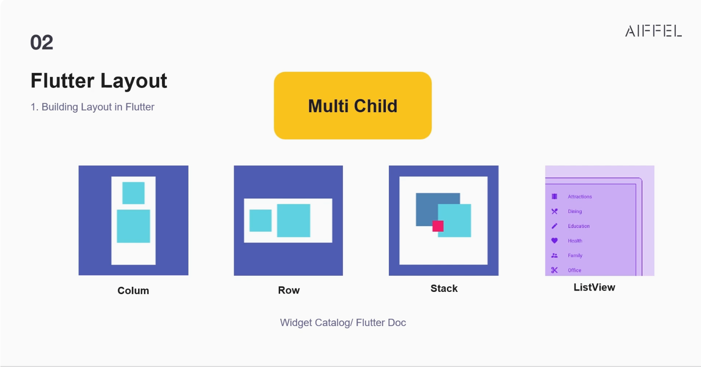

---

밑에 몇개가 될지 모르는 child를 가지고 있어서 들어오는 순서대로 쌓아줄때 column을 사용한다.

---

---
triger : 트리거는 애니메이션을 시작하는 것. 사용자가 특정한 액션을 취하면 애니메이션이 시작된다.

tween : 트윈은 애니메이션의 시작과 끝을 정의하는 것(애니메이션 변화 범위). 애니메이션의 시작과 끝을 정의하고 그 사이의 값을 애니메이션으로 만들어준다.

controller : 컨트롤러는 애니메이션을 제어하는 것. 애니메이션을 시작하고 멈추고 반복하고 정지하는 것을 컨트롤러가 담당한다.

---
🔶 Animation 만들기

Animation은 쉽게 움직이는 그림이라고 생각할 수 있으며, 구제적으로는 시간에 따라 변화하는 값의 시퀀스입니다. 예를 들어, Animation을 통해 위젯의 위치, 크기, 투명도 등을 부드럽게 변화시킬 수 있습니다.

Trigger, Tween, Controller는 Animation을 다루는 데 사용되는 개념들입니다.

---
### 3-3. Navigation & Routing

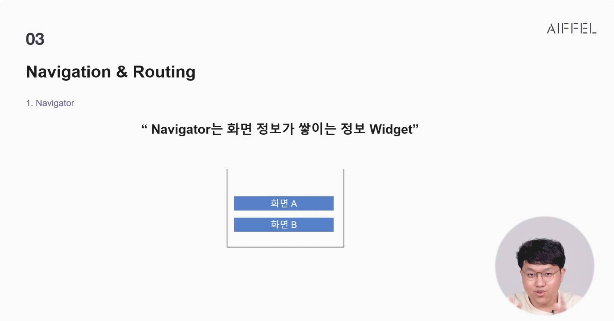
컵안에 화면이 하나씩 쌓여 있는 구조
Navigator는 화면 정보가 쌓이는 정보 Widget입니다. Navigator를 사용하여 다른 화면으로 이동하거나 이전 화면으로 돌아갈 수 있습니다.

---

---
pop()을 사용하면 스택에서 제거된다.
페이지를 다음과 같이 저장한다고 생각하면 된다. 뒤로가기 버튼을 눌러 화면 B가 나와야 하면 push()를 사용하고 화면 B에서 다시 화면 A로 돌아가야 하면 pop()을 사용한다.

---
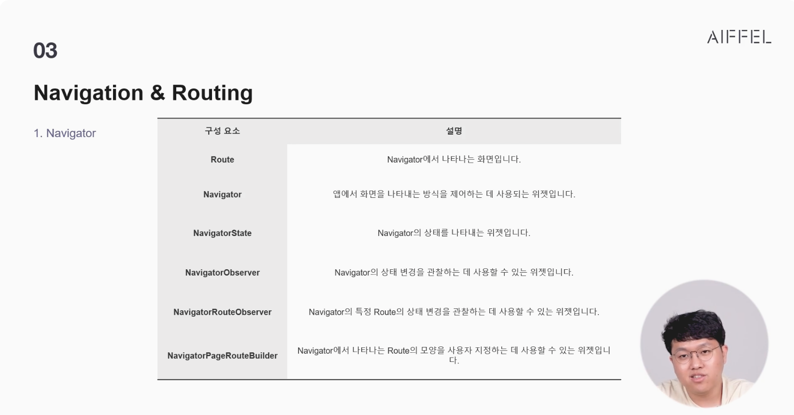

---
네비게이터와 라우터 : 네비게이터는 그 화면까지 갈 수 있는 자동차이고 라우터는 그 화면의 주소라고 생각하면 편하다.
네비게이터와 라우터 사이 네비게이션처럼 안내를 해주는 경로를 설명하는 방식이 두가지가 있다

---

---
NamedRouter : 라우터를 이름으로 지정해주는 방식 (화면숫자가 많지 않을때 화면의 이름을 전부 지어주는 방식)

---

