## 4-1. State Management

---

[노트 1] State Management 1

학습 내용
1. State Management
  - State Management
  - setState
  - getx/Bloc/Riverpod
2. HTTP / Networking
  - HTTP
  - JSON
  - JSON Serialization
  - http/dio
3. Firebase
  - Firebase란?
  - Firebase 사용하기
  - To-do App 만들기
4. TicTok Clone
  - 프로젝트 구성
  - 프로젝트 실습
  - 프로젝트 과제

---
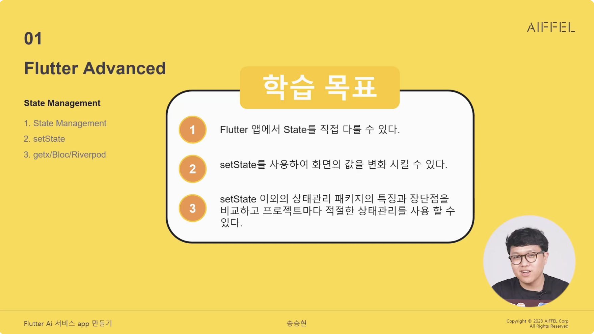

---
[영상 2] State Management 2

---


State Management

다음 이미지는 플러터 위젯의 라이프사이클을 한 장으로 표현한 이미지입니다.


위 이미지를 보면, 플러터 위젯은 다음과 같은 라이프사이클을 가지고 있습니다.
위젯이 생성되기 시작할때 스테이트도 시작된다.

---
🔶 createState()
createState() 메서드는 StatefulWidget과 연결된 State 객체를 생성하고 반환합니다.

#StatefulWidget, #오버라이드

```dart
class Mywidget extends StatefulWidget {
  @override
  _MyWidgetState createState() => _MyWidgetState();
}
```

---
🔶 initState()
initState() 메서드는 해당 State 객체를 초기화하는 데 사용됩니다.

#처음 한번만, #State가 생성된 직후, #데이터 가져오기, #리스터 추가, #초기설정

돌아오는 값이 없기 때문에 void로 선언합니다.
```dart
class _MyWidgetState extends State<MyWidget> {
  @override
  void initState() {
    super.initState();
    //위젯의 상태를 초기화합니다.
    _counter = 0;
  }
}
```

---
🔶 setState()
setState() 메서드는 상태 변화를 감지하고, 화면을 다시 그리는 데 사용되는 메서드입니다.

#상태변경, #build 예약, #데이터변경, #UI 다시 그리기

```dart
floatingActionButton: FloatingActionButton(
        onPressed: () {
          setState(() {
            _counter++;
          });
        },
        child: Icon(Icons.add),
      ),
```

---
🔶 didUpdateWidget()

didUpdateWidget() 메서드는 위젯이 업데이트되었을 때 호출되는 콜백 메서드로, 업데이트된 위젯과 이전의 위젯을 비교하고 관련 작업을 수행하는 데 사용됩니다.

#Widget의상태, #setState, #부모위젯

```dart
void didUpdateWidget(MyHomePage oldWidget) {
		super.didUpdateWidget(oldWidget);

		if (oldWidget.items != items) {
		   setState(() {});
		}
}

```

---
🔶 controller

controller 는 텍스트 입력 필드(Text Field)나 스크롤 가능한 위젯(Scrollable Widget)과 상호 작용하기 위해 사용되는 객체입니다. controller는 해당 위젯과 State를 연결하고, 위젯의 State를 제어하거나 데이터를 검색하는 데 사용됩니다.

#입력값처리, #setState

```dart
class Mywidget extends StatefulWidget {
  @override
  _MyWidgetState createState() => _MyWidgetState();
}

class _MyWidgetState extends State<MyWidget> {
  @override
  void initState() {
    super.initState();

    //컨트롤러를 생성합니다.
    _controller = TextEditingController();
  }

  @override
  Widget build(BuildContext context) {
    return Scaffold(
      appBar: AppBar(
        title: Text('My Widget'),
      ),
      body: TextField(
        controller: _controller,
      ),
    );
  }

  TextEditingController _controller;
}
```

---
[영상 3] State Management 3


---

[영상 실습 4] State Management 4 - controller

컨트롤러 - 아래 예시에서는 텍스트 필드에 입력된 값을 출력하는 예제입니다.

텍스트 에디팅을 제어하는 역할

사용자가 입력한 값을 다이얼로그가 뜰때 값과 길이로 반환하는 코드

사용자가 능동적으로 값을 입력할때 사용됨.

```dart
import 'package:flutter/material.dart';

/// Flutter code sample for [TextField].
void main() => runApp(const TextFieldExampleApp());

class TextFieldExampleApp extends StatelessWidget {
  const TextFieldExampleApp({super.key});

  @override
  Widget build(BuildContext context) {
    return const MaterialApp(
      home: TextFieldExample(),
    );
  }
}

class TextFieldExample extends StatefulWidget {
  const TextFieldExample({super.key});

  @override
  State<TextFieldExample> createState() => _TextFieldExampleState();
}

class _TextFieldExampleState extends State<TextFieldExample> {
  late TextEditingController _controller;

  @override
  void initState() {
    super.initState();
    _controller = TextEditingController(); //컨트롤러를 생성합니다.
  }

  @override
  void dispose() {
    _controller.dispose();
    super.dispose();
  }

  @override
  Widget build(BuildContext context) {
    return Scaffold(
      body: Center(
        child: TextField(
          controller: _controller,
          onSubmitted: (String value) async {
            await showDialog<void>(
              context: context,
              builder: (BuildContext context) {
                return AlertDialog(
                  title: const Text('Thanks!'),
                  content: Text(
                      'You typed "$value", which has length ${value.characters.length}.'),
                  actions: <Widget>[
                    TextButton(
                      onPressed: () {
                        Navigator.pop(context);
                      },
                      child: const Text('OK'),
                    ),
                  ],
                );
              },
            );
          },
        ),
      ),
    );
  }
}
```

---
[영상 5] State Management 5

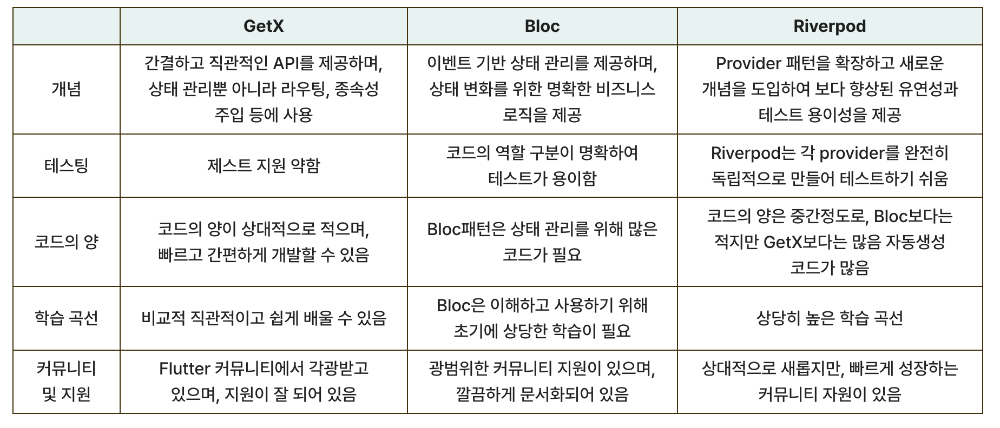

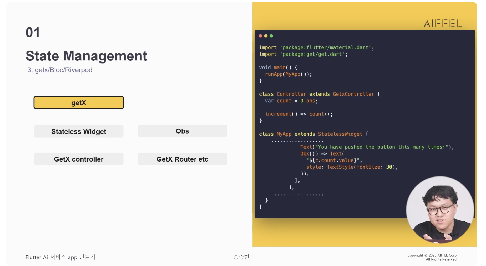
 
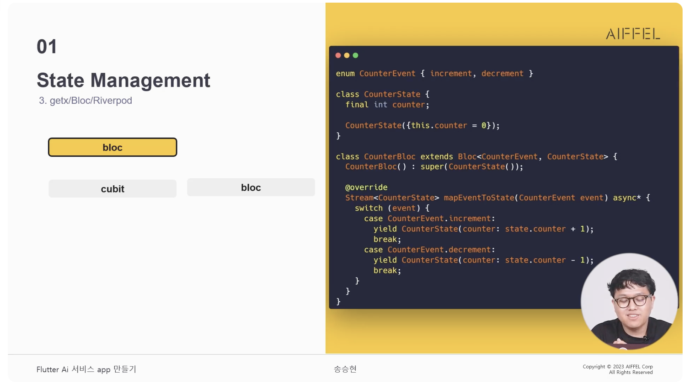

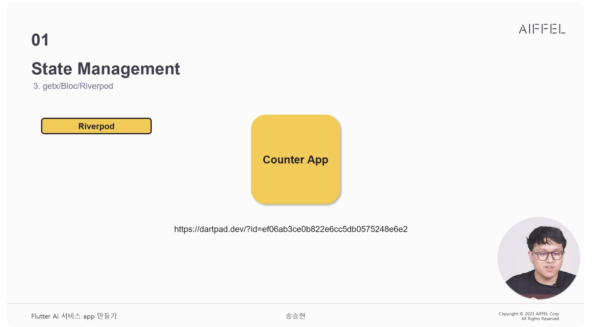

---
[영상 6] State Management 6

Riverpod Count App 예제

```dart
// Copyright (c) 2018, the Dart project authors.  Please see the AUTHORS file
// for details. All rights reserved. Use of this source code is governed by a
// BSD-style license that can be found in the LICENSE file.

import 'package:flutter/material.dart';
import 'package:flutter_riverpod/flutter_riverpod.dart';

// This is a reimplementation of the default Flutter application
// using riverpod.
void main() {
  runApp(
    // Adding ProviderScope enables Riverpod for the entire project
    const ProviderScope(child: MyApp()),
  );
}

/// Providers are declared globally and specify how to create a state
final counterProvider = StateProvider((ref) => 0);

class MyApp extends StatelessWidget {
  const MyApp({Key? key}) : super(key: key);

  @override
  Widget build(BuildContext context) {
    return MaterialApp(
      theme: ThemeData(
        colorSchemeSeed: Colors.blue,
        useMaterial3: true,
      ),
      home: const MyHomePage(),
    );
  }
}

class MyHomePage extends ConsumerWidget {
  const MyHomePage({Key? key}) : super(key: key);

  @override
  Widget build(BuildContext context, WidgetRef ref) {
    return Scaffold(
      appBar: AppBar(
        title: const Text('Riverpod example'),
      ),
      body: Center(
        child: Column(
          mainAxisSize: MainAxisSize.min,
          mainAxisAlignment: MainAxisAlignment.center,
          children: <Widget>[
            const Text('You have pushed the button this many times:'),
            Consumer(
              builder: (context, ref, _) {
                final count = ref.watch(counterProvider);
                return Text(
                  '$count',
                  key: const Key('counterState'),
                  style: Theme.of(context).textTheme.headlineMedium,
                );
              },
            ),
          ],
        ),
      ),
      floatingActionButton: FloatingActionButton(
        key: const Key('increment_floatingActionButton'),
        // The read method is a utility to read a provider without listening to it
        onPressed: () => ref.read(counterProvider.notifier).state++,
        tooltip: 'Increment',
        child: const Icon(Icons.add),
      ),
    );
  }
}
```

---
## 4-2. HTTP / Networking

---
[영상 1] HTTP / Networking 1

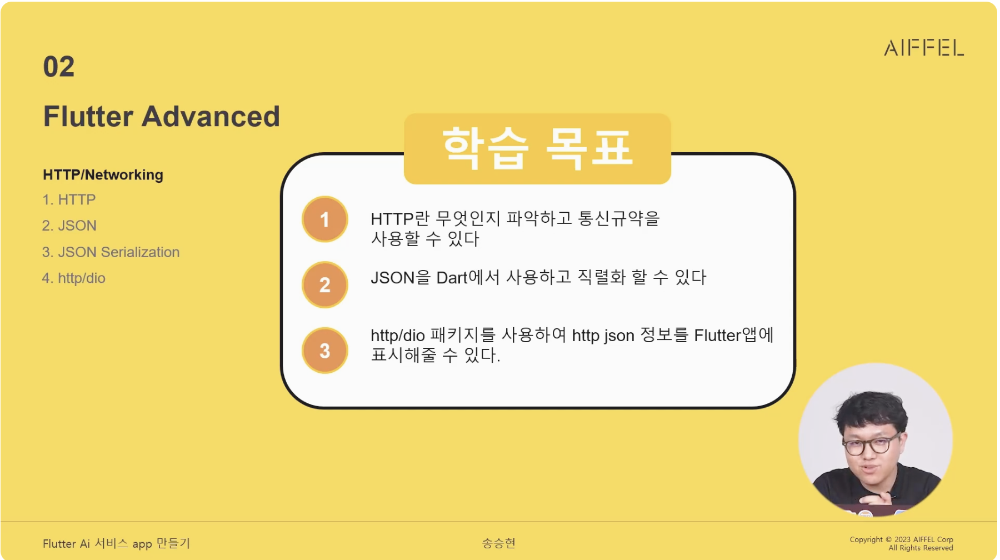

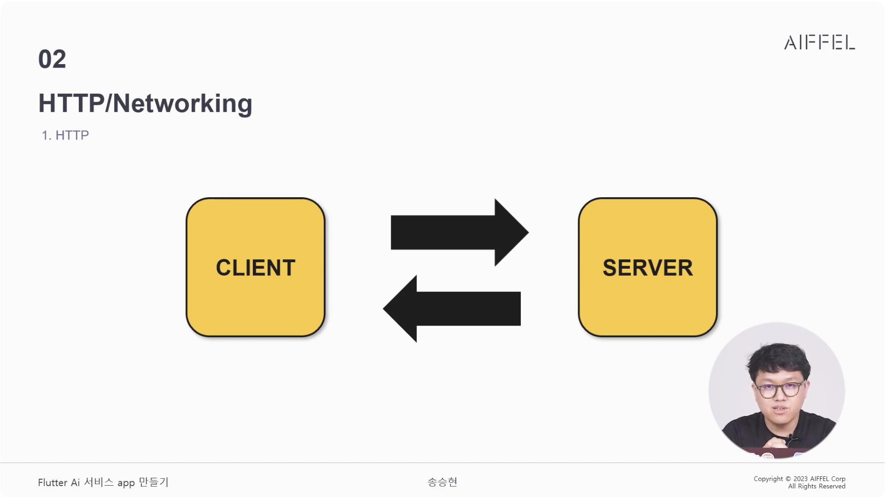

http는 클라이언트와 서버사이 통신을 위한 프로토콜입니다.(약속)

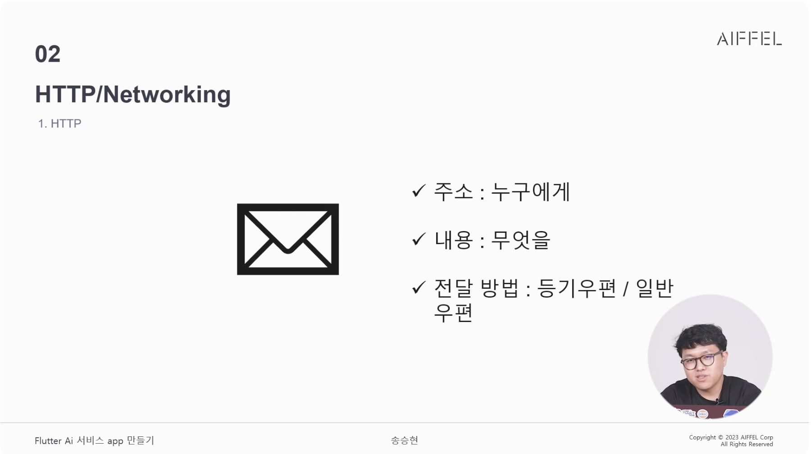

정보를 전송하는 여러 방법이 있다. 다양한 방식 중 널리 대중적으로 쓰이는 것이 http  방식

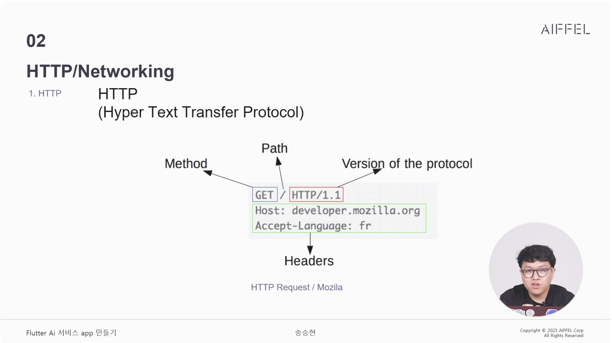
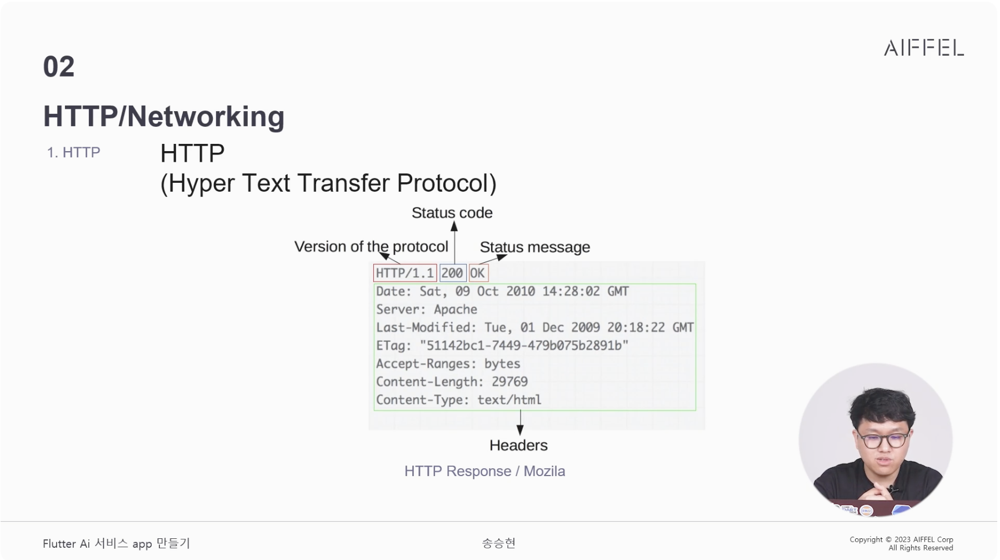
header 가 제목이면 JSON은 내용을 담고있는 본문

---
[노트 1] HTTP / Networking 1

🔶 HTTP
HTTP(Hypertext Transfer Protocol)는 웹에서 데이터를 주고받기 위한 프로토콜입니다. HTTP는 클라이언트와 서버 간의 통신을 가능하게 해주는 규칙과 프로토콜의 집합입니다.

클라이언트와 서버는 웹 상에서 정보를 주고받는 두 주요 역할을 담당합니다. 클라이언트는 사용자가 사용하는 웹 브라우저나 모바일 앱 등을 말하며, 서버는 클라이언트에게 데이터를 제공하거나 요청된 작업을 처리하는 컴퓨터 시스템입니다.

---
[영상 2] HTTP / Networking 2

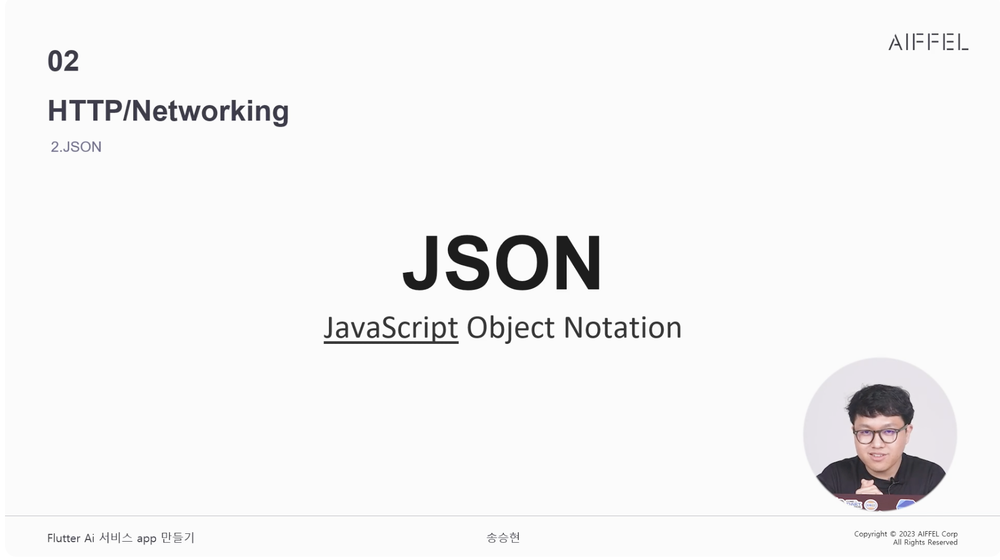

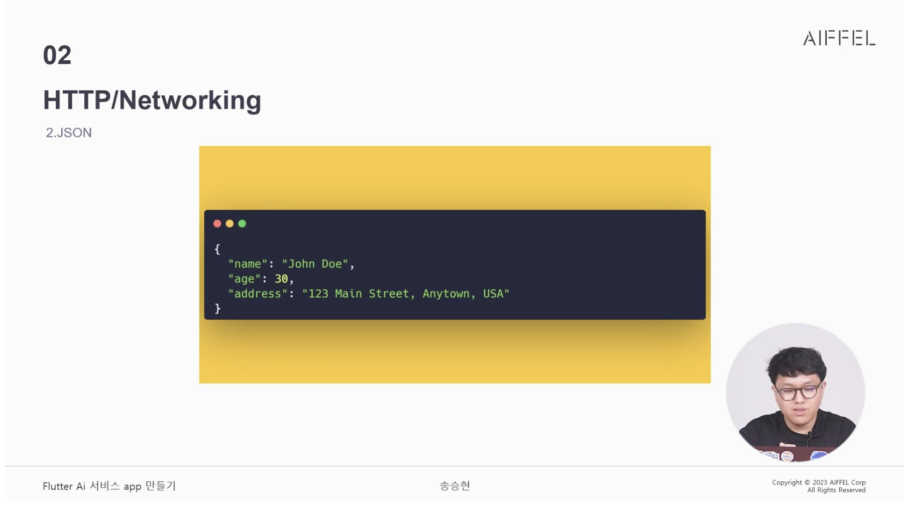

자바의 객체와 비슷한 구조를 가짐.

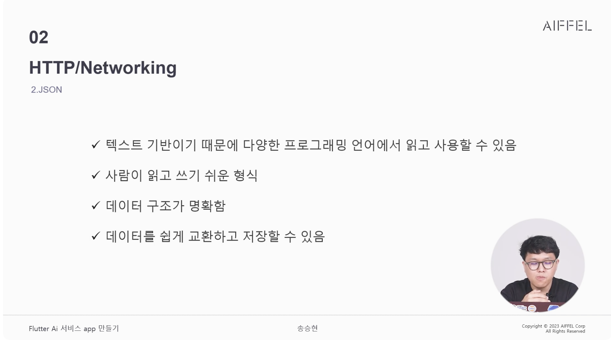

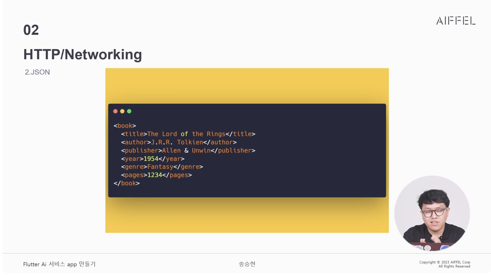

xml은 html과 비슷한 구조를 가지고 있음. tag를 사용해서 만드는 언어를 tag language라고 함.

사람이 자주 쓰는 형태는 아님

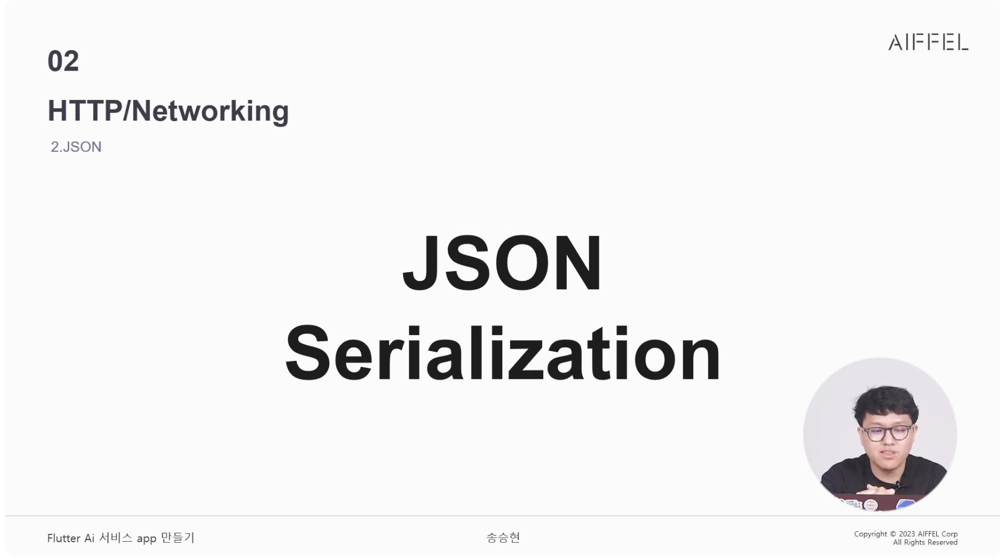

다트에서 쓰는 방식으로 변경하는 것이 필요

json serialization  : json을 다트에서 사용할 수 있도록 변경하는 것

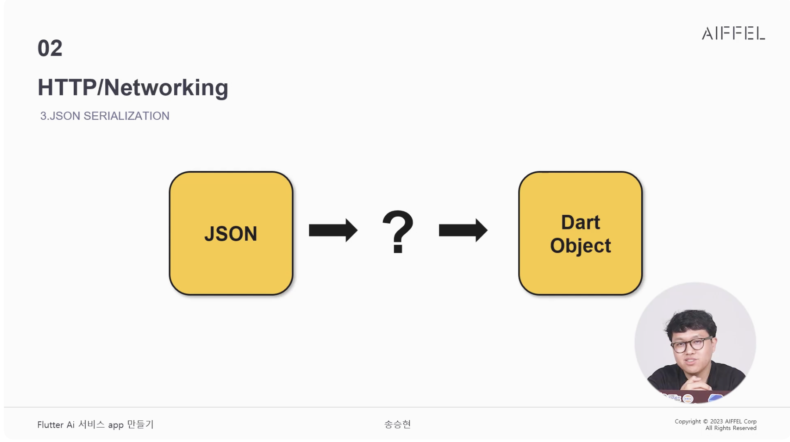

모종의 과정을 거쳐서 json을 다트에서 사용할 수 있도록 변경하는 것


---
[노트 2] HTTP / Networking 2

🔶 JSON
JSON(JavaScript Object Notation)은 데이터 교환을 위한 경량의 데이터 형식입니다. JSON은 사람과 기계 모두 이해하기 쉽고, 다양한 프로그래밍 언어에서 사용할 수 있는 텍스트 형식입니다.

JSON은 일반적으로 데이터를 구조화하고 전송하기 위해 사용됩니다. 데이터는 이름-값 쌍의 집합으로 구성되며, 중괄호 {}로 둘러싸여 있습니다. 각각의 이름-값 쌍은 쉼표로 구분됩니다. 이름은 문자열로 표현되고, 값은 다양한 유형의 데이터를 나타낼 수 있습니다.

예를 들어, 다음은 JSON 형식의 예시입니다.

```json
{
  "name": "John",
  "age": 31,
  "city": "New York"
}
```

🔶 JSON Serialization
JSON 직렬화(Serialization)는 JSON 데이터를 Dart 객체로 변환하는 과정을 말합니다. JSON 직렬화를 통해 Dart 객체로 인식 가능하게 표현하고, 이를 저장하거나 네트워크를 통해 전송할 수 있습니다. 또한, JSON 직렬화는 반대로 Dart 객체를 JSON 데이터로 역직렬화(Deserialization)하는 과정도 포함합니다.

---
[영상 3] HTTP / Networking 3

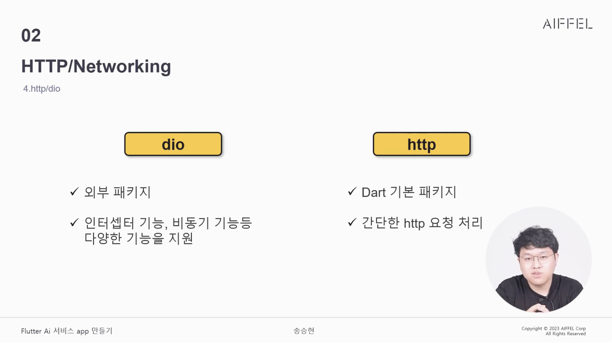

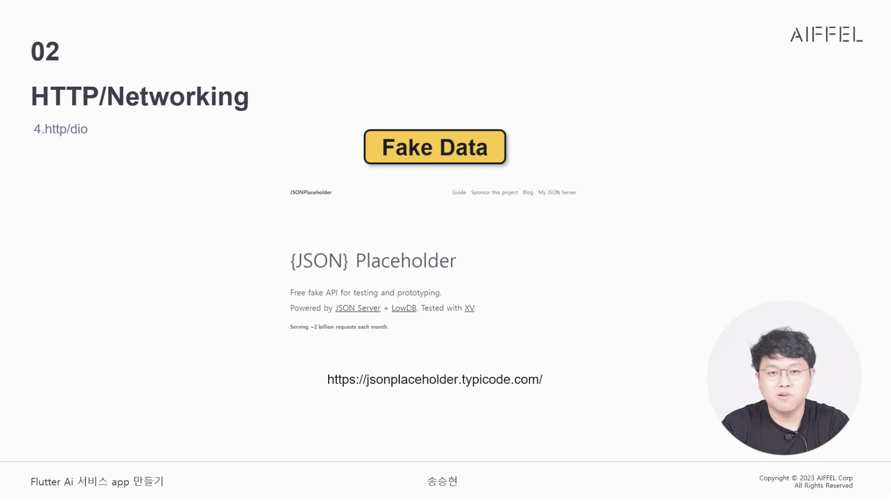
첫 http 실습을 위해 무료로 뿌려주는 사이

---
[노트 3] HTTP / Networking 3
🔶 HTTP / DIO
Flutter에는 네트워크 통신을 위한 다양한 패키지가 있습니다. 그 중에서도 가장 일반적으로 사용되는 두 가지 패키지는 http 패키지와 dio 패키지입니다. http 패키지는 Dart의 기본 패키지로 간단하고 직관적인 API를 제공하며 간단하고 빠른 통신에 적합합니다. dio 패키지는 외부 패키지로 더 많은 기능과 확장성을 제공하여 복잡한 요구사항을 처리할 수 있습니다.

---
[영상 4] HTTP / Networking 4

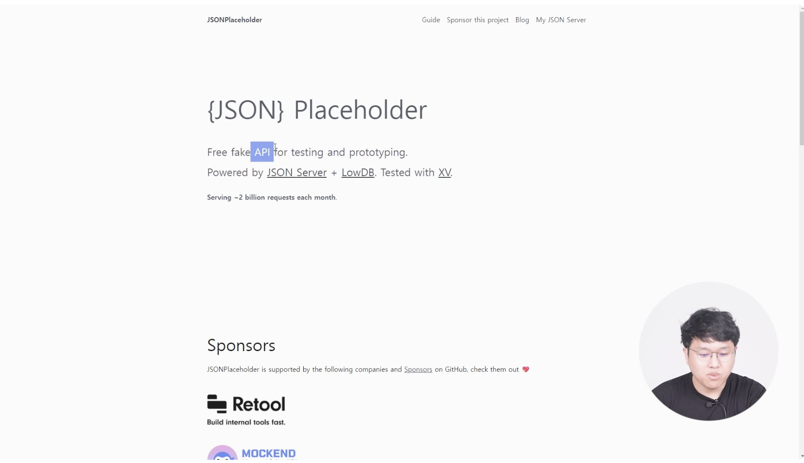

JSONPlaceholder

backend server가 없을때 임시로 가상 데이터를 만들어 api 테스트를 해볼수 있습니다.

영상에 나온 실습 사이트 링크 입니다. 클릭하여 직접 따라 실습해보세요.

https://jsonplaceholder.typicode.com/

---
[영상 5] HTTP / Networking 5

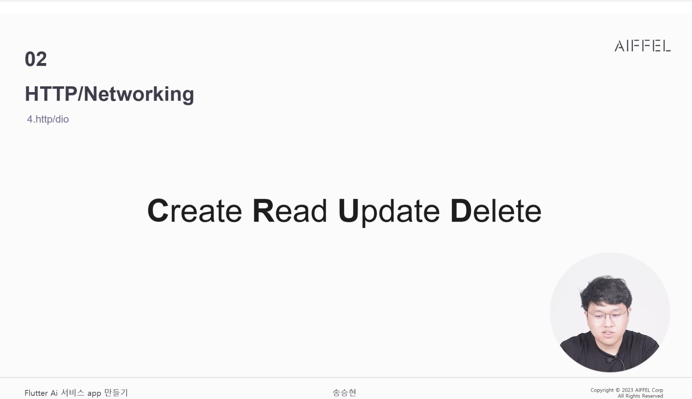

Create, Read, Update, Delete는 데이터베이스 기반 애플리케이션에서 기본적인 데이터 조작 작업을 나타내는 네 가지 기능을 말합니다. 이를 약자로 CRUD라고도 부릅니다.

 - Create (생성): Create는 새로운 데이터를 생성하는 작업을 의미합니다.

 - Read (읽기): Read는 데이터베이스에서 데이터를 읽어오는 작업을 의미합니다.

 - Update (수정): Update는 데이터베이스에 저장된 기존 데이터를 수정하는 작업을 의미합니다.

 - Delete (삭제): Delete는 데이터베이스에서 데이터를 삭제하는 작업을 의미합니다.

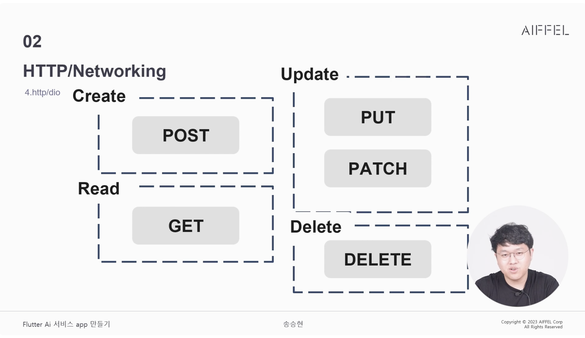

HTTP 프로토콜에서 사용되는 메서드인 POST, GET, PUT, PATCH, DELETE는 CRUD 기능과 연관되어 다음과 같은 역할을 수행합니다:

 - Create (생성):
   - POST: Create 작업에 해당합니다. 새로운 데이터를 서버로 보내어 데이터베이스에 추가하거나 리소스를 생성합니다.

 - Read (읽기):
   - GET: Read 작업에 해당합니다. 서버에서 데이터를 요청하여 읽어옵니다. 특정 리소스의 정보를 가져오거나 데이터베이스에서 데이터를 조회하는 데 사용됩니다.

 - Update (수정):
   - PUT: Update 작업에 해당합니다. 서버에 새로운 데이터를 전송하여 해당 리소스 전체를 업데이트합니다. 전체 리소스를 수정하므로 모든 필드를 포함해야 합니다.
   - PATCH: Update 작업에 해당합니다. 서버에 부분적인 데이터 변경을 전송하여 해당 리소스의 일부를 수정합니다. 전체 리소스를 보내는 것이 아니라 변경된 부분만 업데이트합니다.

 - Delete (삭제):
   - DELETE: Delete 작업에 해당합니다. 서버에 삭제할 리소스의 식별자를 보내어 해당 리소스를 삭제합니다. 데이터베이스에서 해당 데이터를 제거하거나 리소스를 삭제하는 데 사용됩니다.

---
[영상 6] HTTP / Networking 6

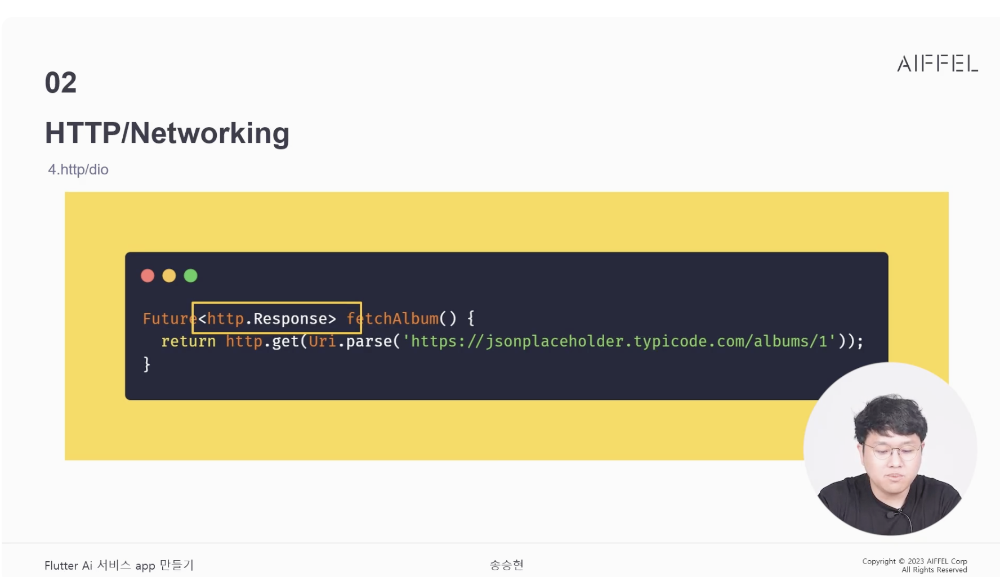

http.Response - http 요청을 하고 나서 리스폰스가 온 다음 fetchAlbum() 함수가 리스폰스를 받아서 처리하는 함수

다음 코드는 fetchAlbum()라는 함수를 정의하고 있습니다. 이 함수는 HTTP GET 요청을 사용하여 https://jsonplaceholder.typicode.com/albums/1 URL로부터 앨범 데이터를 가져오는 작업을 수행합니다.

```dart
Future <http.Response> fetchAlum() {
  return http.get(Uri.parse('https://jsonplaceholder.typicode.com/albums/1'));
}
```

---
[영상 7] HTTP / Networking 7

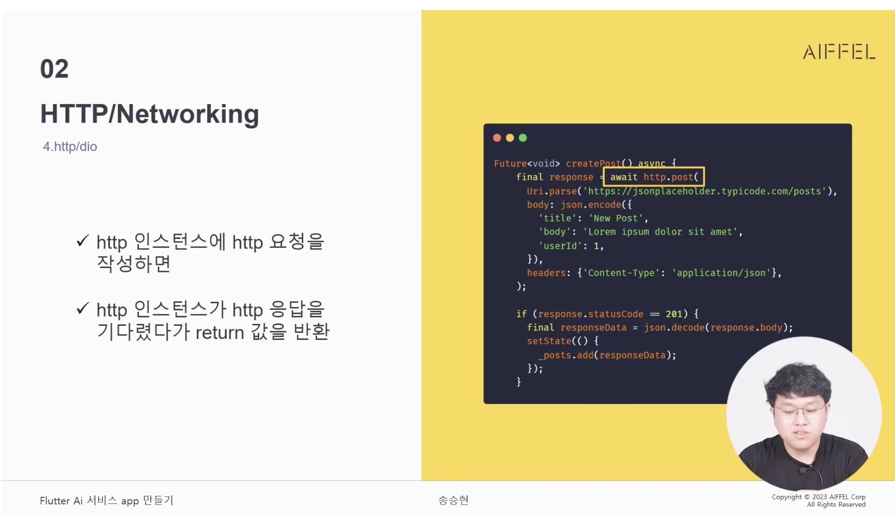

CreatePost 포스트를 만드는 요청을 만든 코드

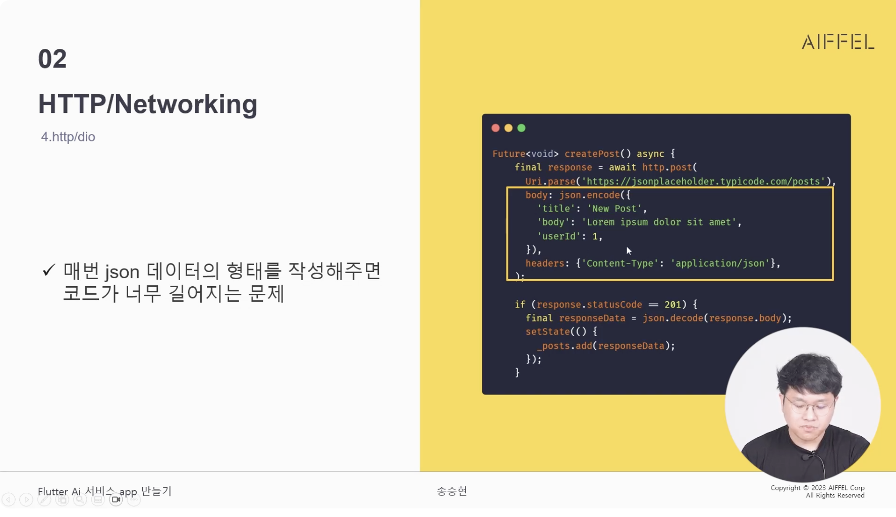
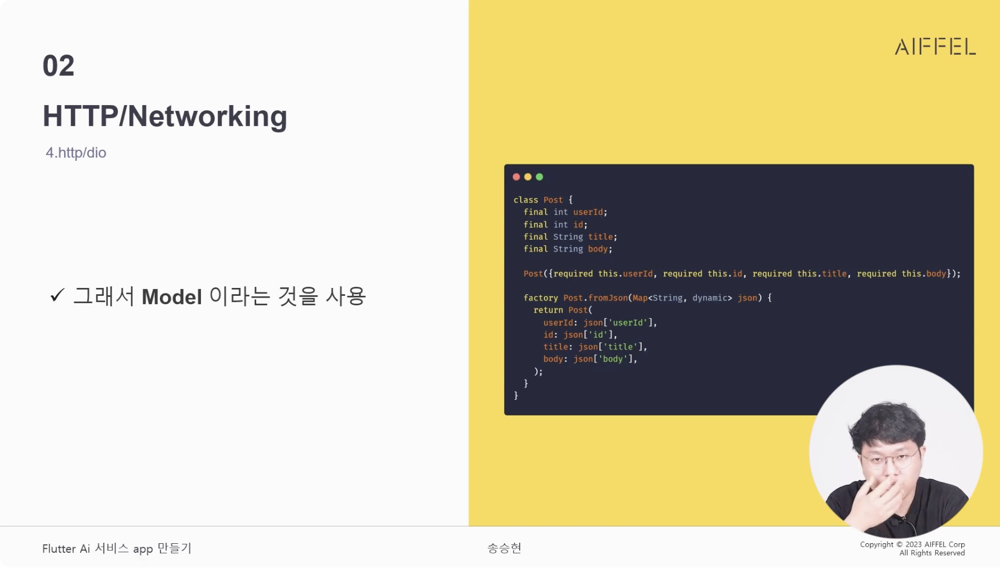
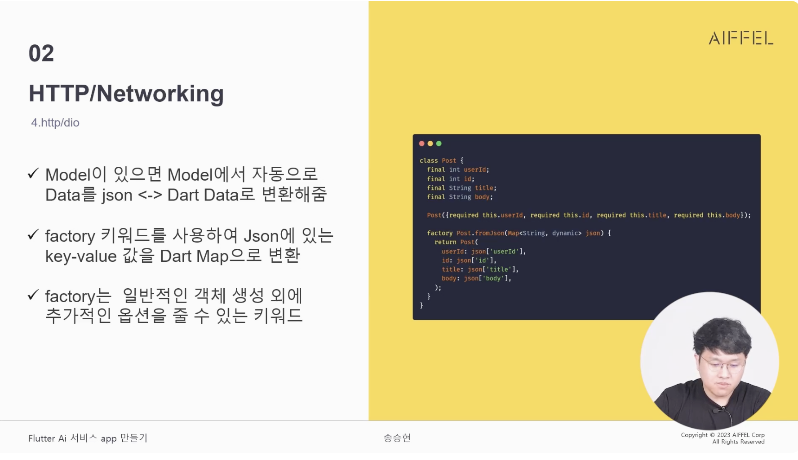

---
[노트 7] HTTP / Networking 7

다음 코드는 createPost()라는 함수를 정의하고 있습니다. 이 함수는 HTTP POST 요청을 사용하여 새로운 게시물을 생성하는 작업을 수행합니다.

```dart
Future<void> createPost() async {
  final response = await http.post(
    Uri.parse('https://jsonplaceholder.typicode.com/posts'),
    body: json.encode({
      'title': 'New Post',
      'body': 'Lorem ipsum dolor sit amet',
      'userId': 1,
    }),
    headers: {'Content-Type': 'application/json'},
  );

  if (response.statusCode = 201) {
    final responseData = json.decode(response.body);
    setState(() {
      _posts.add(responseData);
    });
  }
}
```

다음 코드는 위 코드의 json 데이터 형태 작성의 비효율성을 해결한 코드입니다. Post 클래스를 정의하고 있으며, 게시물을 나타내는 데이터 Model을 구성하는 필드와 생성자, 그리고 JSON 데이터를 Post 객체로 변환하는 팩토리 메서드를 제공합니다.

```dart
class Post {
  final int userId;
  final int id;
  final String title;
  final String body;

  Post({required this.userId, required this.id, required this.title, required this.body});

  factory Post.fromJson(Map<String, dynamic> json) {
    return Post(
      userId: json['userId'],
      id: json['id'],
      title: json['title'],
      body: json['body'],
    );
  }
}
```

---
[영상 8] HTTP / Networking 8

```dart
import 'package:flutter/material.dart';
import 'package:http/http.dart' as http;
import 'dart:convert';

void main() => runApp(MyApp());

class Post {
  final int userId;
  final int id;
  final String title;
  final String body;

  Post({required this.userId, required this.id, required this.title, required this.body});

  factory Post.fromJson(Map<String, dynamic> json) {
    return Post(
      userId: json['userId'],
      id: json['id'],
      title: json['title'],
      body: json['body'],
    );
  }
}

class MyApp extends StatelessWidget {
  @override
  Widget build(BuildContext context) {
    return MaterialApp(
      title: 'HTTP Example',
      theme: ThemeData(
        primarySwatch: Colors.blue,
      ),
      home: MyHomePage(),
    );
  }
}

class MyHomePage extends StatefulWidget {
  @override
  _MyHomePageState createState() => _MyHomePageState();
}

class _MyHomePageState extends State<MyHomePage> {
  List<Post> _posts = [];

  Future<void> fetchPosts() async {
    final response = await http.get(Uri.parse('https://jsonplaceholder.typicode.com/posts'));

    if (response.statusCode == 200) {
      final responseData = json.decode(response.body);
      setState(() {
        _posts = List<Post>.from(responseData.map((post) => Post.fromJson(post)));
      });
    } else {
      showDialog(
        context: context,
        builder: (context) => AlertDialog(
          title: Text('Error'),
          content: Text('Failed to fetch posts.'),
          actions: [
            TextButton(
              onPressed: () => Navigator.pop(context),
              child: Text('OK'),
            ),
          ],
        ),
      );
    }
  }

  @override
  void initState() {
    super.initState();
    fetchPosts();
  }

  @override
  Widget build(BuildContext context) {
    return Scaffold(
      appBar: AppBar(
        title: Text('HTTP Example'),
      ),
      body: ListView.builder(
        itemCount: _posts.length,
        itemBuilder: (context, index) {
          final post = _posts[index];
          return ListTile(
            title: Text(post.title),
            subtitle: Text(post.body),
          );
        },
      ),
    );
  }
}
```

---
## 4-3. Firebase

---
[영상 1] Firebase란?
