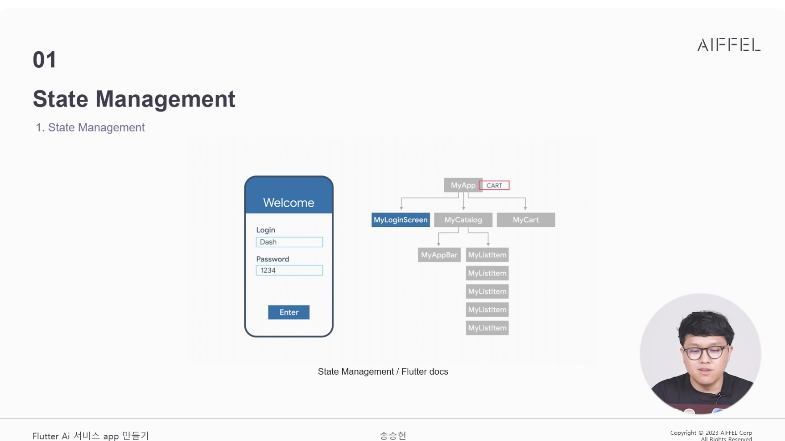
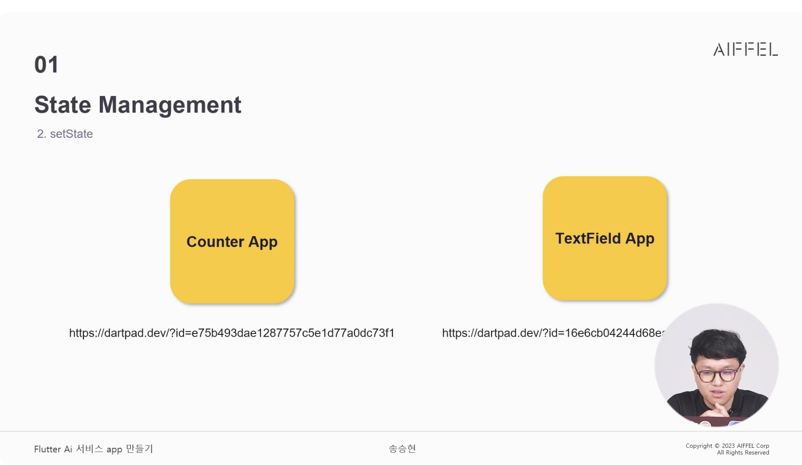

## 4-1. State Management

---

[노트 1] State Management 1

학습 내용
1. State Management
  - State Management
  - setState
  - getx/Bloc/Riverpod
2. HTTP / Networking
  - HTTP
  - JSON
  - JSON Serialization
  - http/dio
3. Firebase
  - Firebase란?
  - Firebase 사용하기
  - To-do App 만들기
4. TicTok Clone
  - 프로젝트 구성
  - 프로젝트 실습
  - 프로젝트 과제

---


---
[영상 2] State Management 2

---


State Management

다음 이미지는 플러터 위젯의 라이프사이클을 한 장으로 표현한 이미지입니다.


위 이미지를 보면, 플러터 위젯은 다음과 같은 라이프사이클을 가지고 있습니다.
위젯이 생성되기 시작할때 스테이트도 시작된다.

---
🔶 createState()
createState() 메서드는 StatefulWidget과 연결된 State 객체를 생성하고 반환합니다.

#StatefulWidget, #오버라이드

```dart
class Mywidget extends StatefulWidget {
  @override
  _MyWidgetState createState() => _MyWidgetState();
}
```

---
🔶 initState()
initState() 메서드는 해당 State 객체를 초기화하는 데 사용됩니다.

#처음 한번만, #State가 생성된 직후, #데이터 가져오기, #리스터 추가, #초기설정

돌아오는 값이 없기 때문에 void로 선언합니다.
```dart
class _MyWidgetState extends State<MyWidget> {
  @override
  void initState() {
    super.initState();
    //위젯의 상태를 초기화합니다.
    _counter = 0;
  }
}
```

---
🔶 setState()
setState() 메서드는 상태 변화를 감지하고, 화면을 다시 그리는 데 사용되는 메서드입니다.

#상태변경, #build 예약, #데이터변경, #UI 다시 그리기

```dart
floatingActionButton: FloatingActionButton(
        onPressed: () {
          setState(() {
            _counter++;
          });
        },
        child: Icon(Icons.add),
      ),
```

---
🔶 didUpdateWidget()

didUpdateWidget() 메서드는 위젯이 업데이트되었을 때 호출되는 콜백 메서드로, 업데이트된 위젯과 이전의 위젯을 비교하고 관련 작업을 수행하는 데 사용됩니다.

#Widget의상태, #setState, #부모위젯

```dart
void didUpdateWidget(MyHomePage oldWidget) {
		super.didUpdateWidget(oldWidget);

		if (oldWidget.items != items) {
		   setState(() {});
		}
}

```

---
🔶 controller

controller 는 텍스트 입력 필드(Text Field)나 스크롤 가능한 위젯(Scrollable Widget)과 상호 작용하기 위해 사용되는 객체입니다. controller는 해당 위젯과 State를 연결하고, 위젯의 State를 제어하거나 데이터를 검색하는 데 사용됩니다.

#입력값처리, #setState

```dart
class Mywidget extends StatefulWidget {
  @override
  _MyWidgetState createState() => _MyWidgetState();
}

class _MyWidgetState extends State<MyWidget> {
  @override
  void initState() {
    super.initState();

    //컨트롤러를 생성합니다.
    _controller = TextEditingController();
  }

  @override
  Widget build(BuildContext context) {
    return Scaffold(
      appBar: AppBar(
        title: Text('My Widget'),
      ),
      body: TextField(
        controller: _controller,
      ),
    );
  }

  TextEditingController _controller;
}
```

---
[영상 3] State Management 3



---

