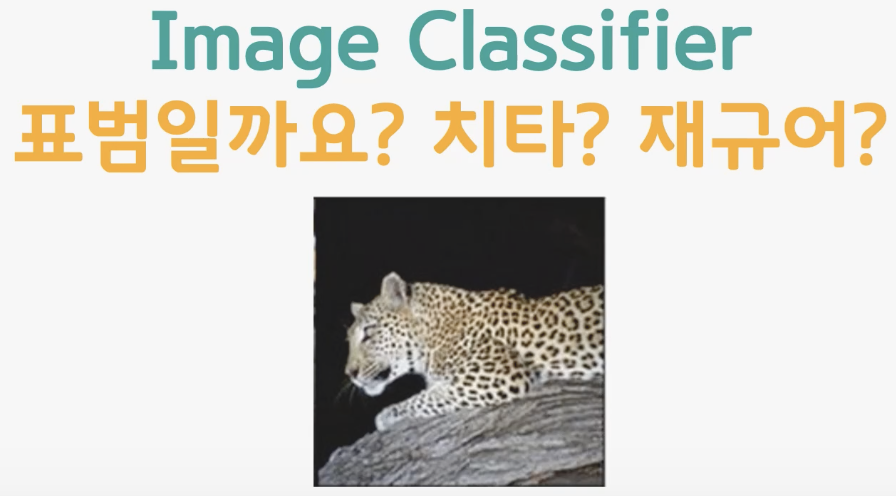
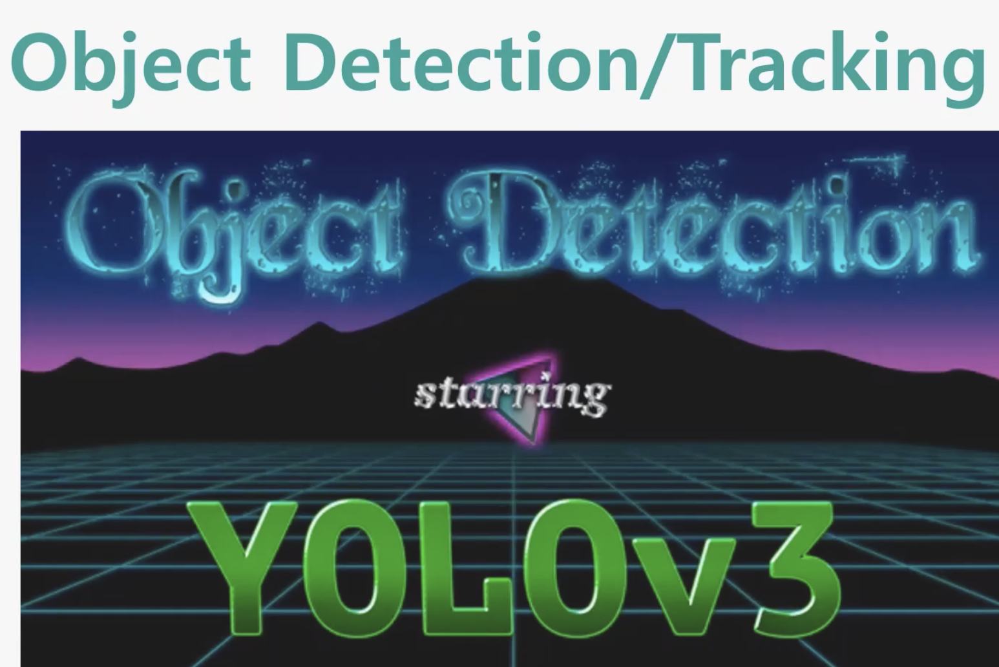
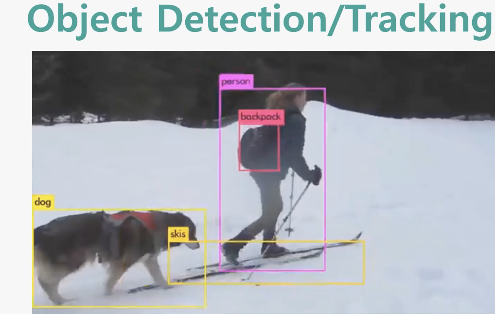

# 2. 기본 중의 기본, Paired Data!  

## 2-1. Paired Data란 무엇인가?

- Paired Data는 무엇일까요?
- Paired Data는 두 개의 변수가 서로 연관되어 있는 데이터를 말합니다.
- 거의 모든 인공지능 개발자들이 가장 먼저 만들어보는 인공지능 기술은 숫자 손글씨 인식기

  

- 페어드 데이터는 입력과 입력 이미지와 정답이 하나의 쌍을 이뤄서 데이터로 주어짐  
- 입력 이미지와 정답은 0 입력 이미지와 정답은 5 이런 식으로 입력과 정답이 하나의 쌍을 이뤄서 데이터로 주어진다라고 해서 
  페어드 데이터라 부름
- 페어드 데이터가 있으면 손쉽게 인공지능 알고리즘을 만들어낼 수 있음  

## 2-2. image classifier(표범일까 치타일까 재규어일까) 

  

- 정답은 표범. 당연히 페어드 데이터로 구성되어 있음

## 2-3. object detection/tracking(물체 검출/추적)  

  

- image classifier 같은 경우는 그 전체 사진에 어떤 오브젝트가 있는지를 맞추는 것  
- object detection/tracking은 이미지 안에서 오브젝트가 어디에 있는지까지도 맞출 수 있음.  

  
- 이미지 안에서 사람과 백팍과 개, 스키를 구분해주는 데이터 라벨러 직업과 레이블드 데이터 및 페어드 데이터를 인공지능을 이용해 만드는 기업도 있음

** YOLO(You Only Look Once)는 end-to-end object detection system으로 이미지 내의 객체를 실시간으로 탐지하는 딥러닝 알고리즘 중 하나입니다. YOLO V3는 이전 버전보다 더 나은 성능을 발휘하며, Darknet-53 아키텍처를 이용하여 더욱 큰 모델을 만들 수 있으며, 데이터셋과 모델 아키텍처 최적화를 수행하여 메모리 사용량을 줄이고 연산 속도를 높였습니다. YOLO V3는 전체 이미지를 한 번에 보면서 여러 개의 바운딩 박스(Bounding Box)를 생성하며, 그 후 NMS(Non-Maximum Suppression) 알고리즘을 통해 겹치는 영역을 제거하여 최종 Detection 결과를 도출합니다. 이를 통해 속도는 빠르면서도 성능이 우수하다는 특징을 가지고 있습니다. 추가적으로 YOLO V3는 다양한 분야에서 적용될 수 있습니다. 대표적으로 자율주행차량에서의 보행자 인식 기술과 CCTV 모니터링 시스템에서의 안전 및 범죄 예방에 사용될 수 있습니다.  

