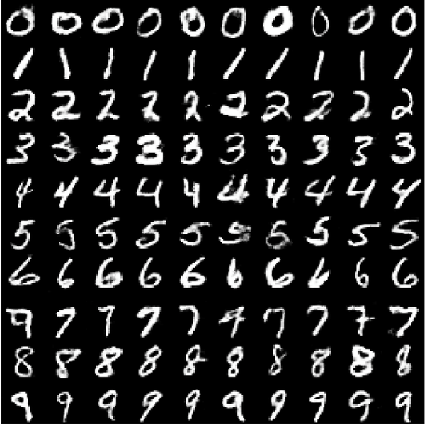
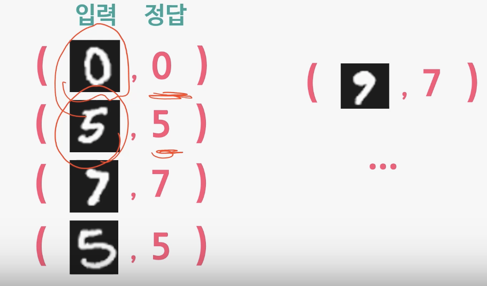
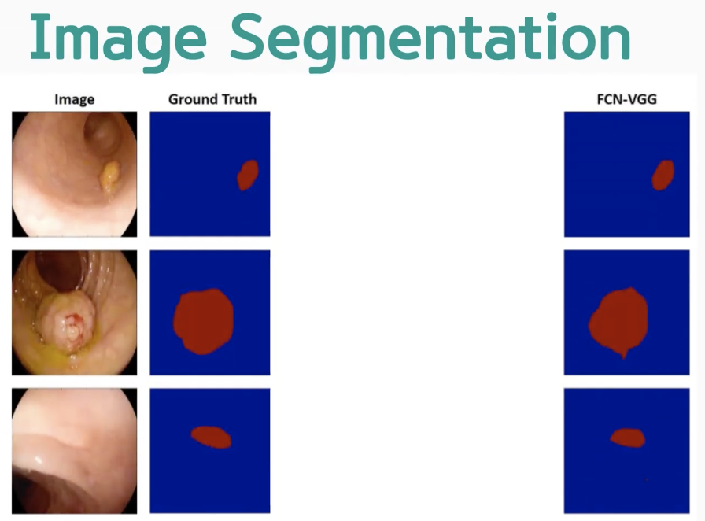
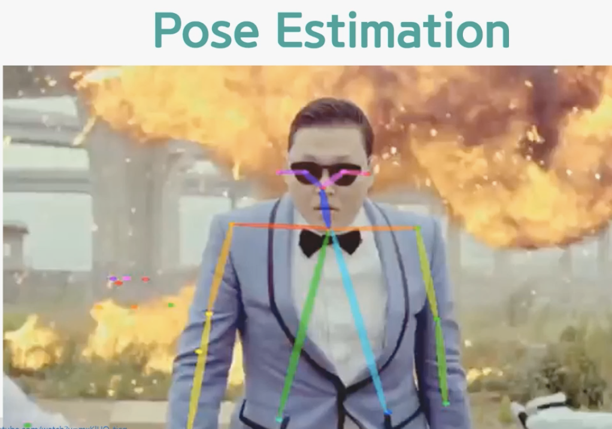
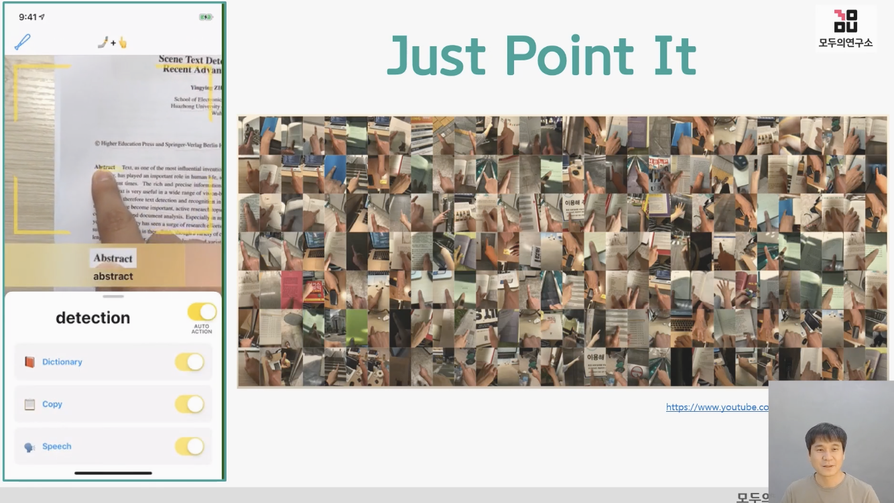
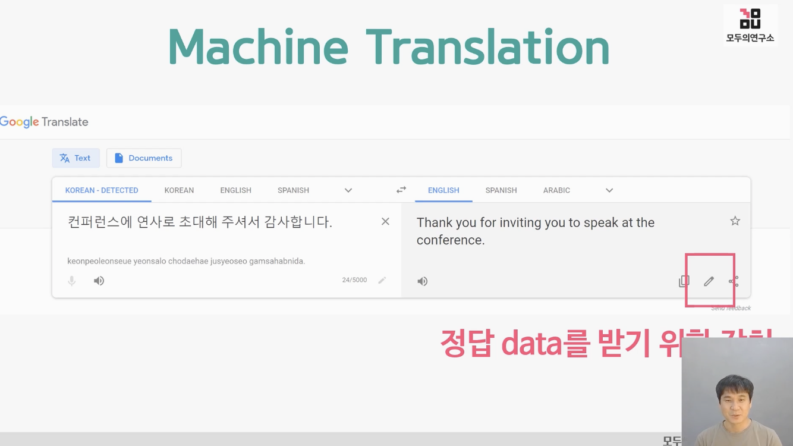
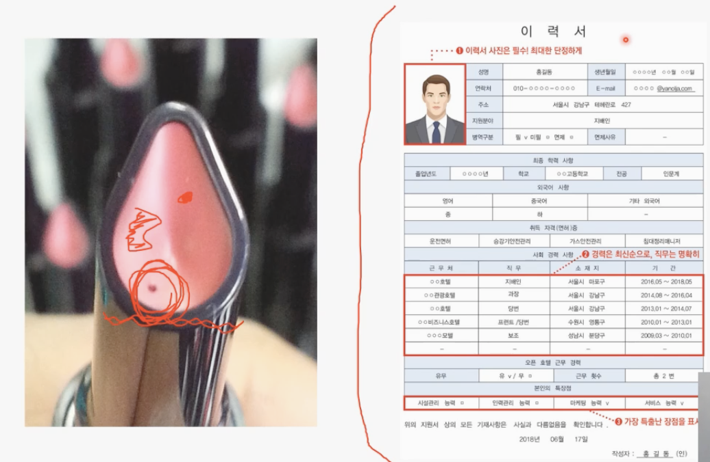

# 2. 기본 중의 기본, Paired Data!  

## 2-1. Paired Data란 무엇인가?

- Paired Data는 무엇일까요?
- Paired Data는 두 개의 변수가 서로 연관되어 있는 데이터를 말합니다.
- 거의 모든 인공지능 개발자들이 가장 먼저 만들어보는 인공지능 기술은 숫자 손글씨 인식기

  

- 페어드 데이터는 입력과 입력 이미지와 정답이 하나의 쌍을 이뤄서 데이터로 주어짐  
- 입력 이미지와 정답은 0 입력 이미지와 정답은 5 이런 식으로 입력과 정답이 하나의 쌍을 이뤄서 데이터로 주어진다라고 해서 
  페어드 데이터라 부름
- 페어드 데이터가 있으면 손쉽게 인공지능 알고리즘을 만들어낼 수 있음  

## 2-2. image classifier(표범일까 치타일까 재규어일까) 

  

- 정답은 표범. 당연히 페어드 데이터로 구성되어 있음

## 2-3. object detection/tracking(물체 검출/추적)  

  

- image classifier 같은 경우는 그 전체 사진에 어떤 오브젝트가 있는지를 맞추는 것  
- object detection/tracking은 이미지 안에서 오브젝트가 어디에 있는지까지도 맞출 수 있음.  

  
- 이미지 안에서 사람과 백팍과 개, 스키를 구분해주는 데이터 라벨러 직업과 레이블드 데이터 및 페어드 데이터를 인공지능을 이용해 만드는 기업도 있음

** YOLO(You Only Look Once)는 end-to-end object detection system으로 이미지 내의 객체를 실시간으로 탐지하는 딥러닝 알고리즘 중 하나입니다.
YOLO V3는 전체 이미지를 한 번에 보면서 여러 개의 바운딩 박스(Bounding Box)를 생성하며, 그 후 NMS(Non-Maximum Suppression) 알고리즘을 통해 겹치는 영역을 제거하여 최종 Detection 결과를 도출합니다. 
이를 통해 속도는 빠르면서도 성능이 우수하다는 특징을 가지고 있습니다. 추가적으로 YOLO V3는 다양한 분야에서 적용될 수 있습니다. 
대표적으로 자율주행차량에서의 보행자 인식 기술과 CCTV 모니터링 시스템에서의 안전 및 범죄 예방에 사용될 수 있습니다.  

## 2-4. image segmentation(이미지 분할)

  

- 네모가 아니라 비정형의 어떤 도형으로 오브젝트를 찾아내는 것이 image segmentation
- 이미지와 같은 페어드 페어드 데이터가 많이 있다면 그걸로 학습을 시킨 다음에 인공지능에게 용종을 내시경 사진에서 찾게함

- 용종검출에서 object detection이 아닌, image segmentation 기법이 활용되는 이유는 무엇일까요?  
  - 픽셀 단위 정확한 분류 : 내시경 영상에서 용종 검출 시, 객체 인식보다는 용종 영역의 정확한 경계를 추출하는 것이 중요. 이를 위해서, 객체 인식보다 픽셀 단위로 정확한 분류가 필요함.

## 2-5. pose estimation  

- Pose Estimation은 사람이 취한 동작을 포즈(Pose)로 인식하여, 이를 2차원 이미지 상에서 추정하는 기술  
- 2D 또는 3D 이미지에서 사람의 관절 위치를 인식하거나 추정하는 방식으로 동작합니다.  
- 주로 컴퓨터 비전, 광학 인식, 로봇 제어, 가상현실 같은 분야에서 활용됩니다.  
- 2D Pose Estimation은 2D 이미지에서 사람의 관절 위치를 추정하는 방식으로, 보통 CNN(Convolutional Neural Network) 기반의 Detector-Descriptor 방식을 사용  
- 학습 모델이 사람의 관절 위치와 관련된 정보를 학습하면, 이후 실제로 관절 위치를 추정할 때 해당 이미지에서 대상을 감지하고, 각각의 관절 위치를 예측합니다.  
- 3D Pose Estimation은 사람의 3D 모델을 이용하여 사람의 동작을 추정합니다. 이는 주로 인공지능과 로봇 공학 분야에서 사용되며, 2D Pose Estimation 보다 더 많은 정보를 포함할 수 있습니다.  
- 3D 모델을 이용하므로 실시간 동작 예측 및 물체 추적, 인간 모방 로봇 등과 같은 응용을 사용할 수 있습니다.   
- Pose Estimation은 스포츠, 자동차 차선 인식, 자세 교정, 인체 모델링, 생체 인증 등의 다양한 분야에서 사용됩니다.

- 싸이의 강남스타일보다 더 즐거운 pose estimation을 활용 방안을 이야기해보세요.
  - VR 챌린지 게임 : VR 가상현실 게임에서는 실제 위치에 맞춰 플레이어의 동작을 이용해 캐릭터를 움직임으로써 게임을 즐길 수 있습니다. Pose Estimation 기술을 활용하여 플레이어의 동작을 실시간으로 인식하고 적용할 수 있습니다.
  - AI 음악가 : Pose Estimation을 이용해서 연주자들의 동작을 읽어내어 연주하는 AI음악가가 출시되면 어떨까요? 기존에 존재하는 악보를 이용하지 않고, 실제 악기를 연주하는 동작만으로 음악을 자동으로 생성하는 인공지능 음악가를 만들 수 있습니다.
  - 셀프 작곡 : Pose Estimation 기술을 이용하여 사용자의 동작을 파악하고, 이를 분석하여 자동으로 음악 또는 리듬을 생성할 수 있습니다. 자신의 쉽게 구현 가능한 몸짓으로 작곡하는 느낌을 느낄 수 있어, 즐겁고 창의적인 작곡 방식이 될 수 있습니다.
  - 무대 연출 : Pose Estimation 기술을 활용하여 무대 연출을 구성할 수 있습니다. 무대 위에서 춤추는 댄서들의 동작을 추적하고, 이를 활용해 무대배치나 미디어 아트와 결합하는 등 창의적으로 활용될 수 있습니다.

## 2-6. paired data의 활용  

  

- 손끝을 인식 --> 손이 어디를 포인트하고 있는지 확인 --> 그 위치에 있는 단어 혹은 문자를 인식 (ocr) --> 사전을 연결해서 단어의 의미를 찾아 보여줌  
- 인공지능 기술은 손끝을 찾는 것과 글자를 인식하는 거 이 두 가지에 들어가 있음 
-  슈퍼바이즈드 러닝 & 페어드 데이터예요. 

  

- 번역기 같은 경우도 사실은 페어드 데이터를 이용한다고 볼 수가 있음.  
- 피드백 버튼을 눌러 정답이 아닌 번역을 정정하면 구글은 계속해서 정답데이터를 축적함

## 2-7. 우리가 가진 paired data에는 무엇이 있을까  

- 빨간 점이나 기름 등 립스틱의 불량 레이블을 이용한 불량제품 판별
- 이력서의 얼굴, 이력, 나이 등을 이용하여 선발 여부 결정 등
- 영상 내 특정인물만 크롭하여 포커싱 - 오브젝트 트레킹, 페어드 데이터

## 2-8. paired data 만들기
- TeachableMachine을 통해 paired data를 만들고 만든 데이터를 활용해서 즉석으로 딥러닝 분류기 모델생성
