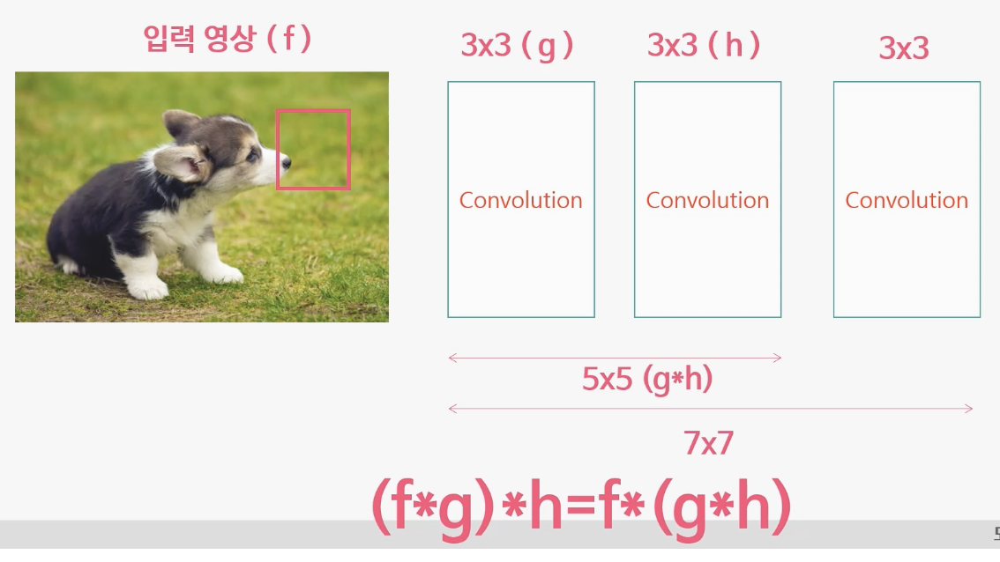
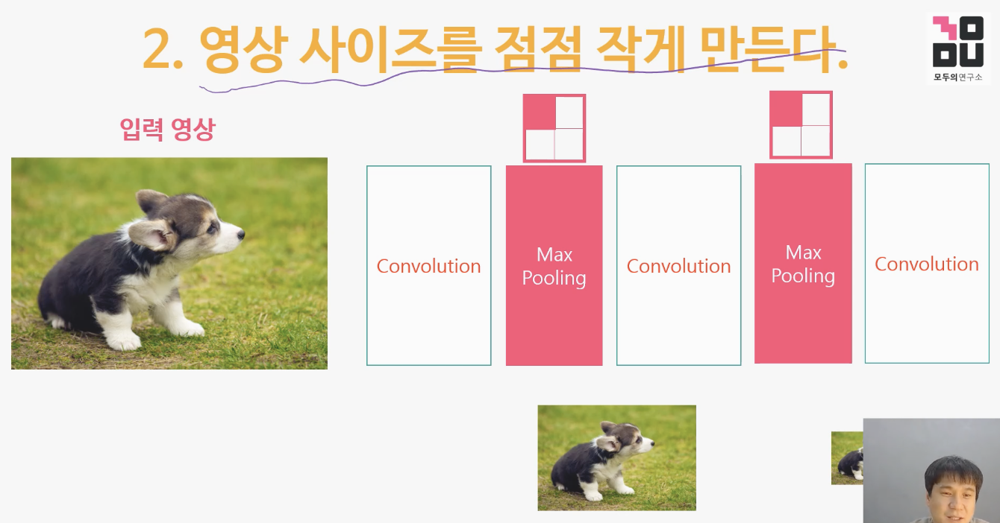
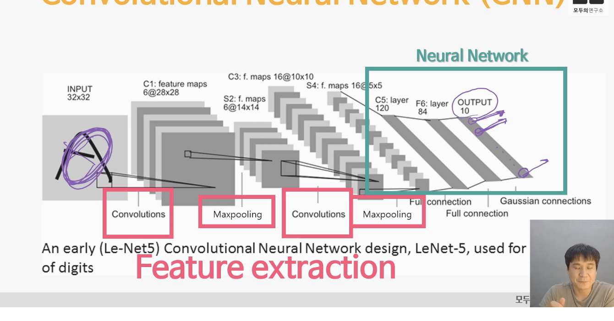
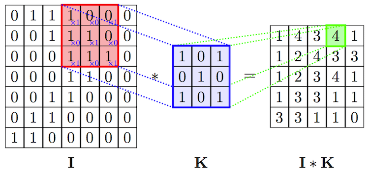
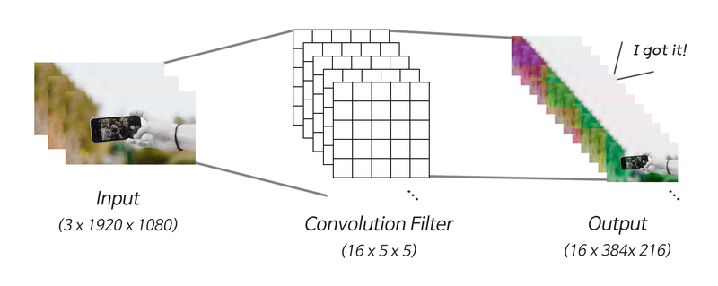
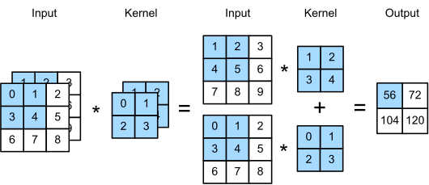

# 7. Convolutional Neural Network 손쉽게 이해하기

## 7-1. CNN의 작동 원리를 이해하자 (1) 필터 사이즈 | 5분

Convolutional Neural Network 손쉽게 이해하기
- 필터 사이즈를 점점 크게 만든다

- 같은 필터 사이즈를 여러번 거친다는 것은 필터 사이즈가 커짐을 의미한다.
- 3x3 필터를 3번 거치면 7x7 필터가 된다.

Q. 서로 다른 크기의 feature를 추출하려면 어떻게 하면 되나요?  

- Convolution layer를 여러 개 쌓으면 됩니다.

## 7-2. CNN의 작동 원리를 이해하자 (2) 영상 사이즈


- 영상 사이즈를 점점 작게 만든다
- 영상 사이즈를 점점 작게 만드는 방법은 Max Pooling을 사용한다.
- Max Pooling은 영상의 사이즈를 줄이는 방법 중 하나이다.
- 가장 큰 값 하나만 내버려두고 나머지를 버린다
- Averge Pooling을 사용하기도 하지만 일반적으로 Max Pooling을 가장 많이 사용하는데 Vanishing gradient 에서 학습량 = 미분값 * 출력값
- Max값을 출력값으로 사용하면 미분값이 1이 되어 학습량이 커지기 때문이다.
- CNN에서는 Convolution Layer와 Max Pooling Layer를 반복적으로 쌓는다.
** Vanishing gradient?
- 깊은 인공 신경망을 학습하다보면 역전파 과정에서 입력층으로 갈 수록 기울기(Gradient)가 점차적으로 작아지는 현상이 발생할 수 있습니다. 입력층에 가까운 층들에서 가중치들이 업데이트가 제대로 되지 않으면 결국 최적의 모델을 찾을 수 없게 됩니다. 이를 기울기 소실(Gradient Vanishing) 이라고 합니다.
반대의 경우도 있습니다. 기울기가 점차 커지더니 가중치들이 비정상적으로 큰 값이 되면서 결국 발산되기도 합니다. 이를 기울기 폭주(Gradient Exploding) 라고 하며, 다음 챕터에서 배울 순환 신경망(Recurrent Neural Network, RNN)에서 쉽게 발생할 수 있습니다. 여기서는 기울기 소실 또는 기울기 폭주를 막는 방법들에 대해서 다룹니다.

Q. Max pooling을 설명하고, Max pooling을 주로 사용하는 이유를 적어보세요.
Max pooling은 4개의 픽셀 중 가장 큰 값만 남기고 버리는 방법입니다. Max pooling을 많이 사용하는 이유는 Vanishing Gradient 문제 때문입니다. weight가 학습될 때, ‘학습되는 양 = 미분값 x 출력값’인데, 학습되는 양이 작으면 학습이 잘 안 되므로 출력값을 최대로 만들기 위해서 가장 큰 값만 사용합니다.  

## 7-3. 영상 특징을 파악하기 위한 CNN의 구조

-숫자 손글씨 인식기

- Convolution Layer와 Max Pooling Layer를 반복적으로 쌓는 구간이 Feature extraction 부분이다. (영상의 특징을 찾음)
- 영상의 특징을 추출해서 학습을 하였더니 성능이 훨씬 좋아짐

Q. CNN은 어떤 구조로 되어 있나요?

- CNN은 feature extraction과 Neural Network로 이루어집니다. feature를 추출하기 위해 Convolution layer와 pooling layer를 쌓았고, 영상에서 추출된 feature를 한 줄로 세워 Neural Network로 분류합니다.  

## 7-4. 지금까지의 내용으로 딥러닝 연구가 가능한가요? Yes!!


- Artistic Style 논문
- 원본 사진 영상에서 외곽선 정보를 가지고 온다
  - 외곽선 정보는 Convolution을 통과한 feature에 정보가 들어 있다. A1과 B1, A2와 B2, A3과 B3을 같게 하면 만든 영상의 외곽선은 사진 영상과 같아진다
- 스타일 정보는 Art 영상에서 가지고 온다
  - 저자들이 참고한 레퍼런스에 의하면 영상의 스타일 정보는 함수h를 통과하면 얻을 수 있다. (함수h=그램매트릭스, 피처와 피처간의 곱하기에 들어있다.) 
-  고흐그림의 스타일과 만드는 영상의 스타일이 같았으면 좋겠다. h(A1) = h(C1)

Q. 영상 스타일 정보는 함수 h를 통해 얻을 수 있다고 하였습니다. 이 함수 h를 정의해 보세요.

- 함수 h는 Gram matrix라고 부르며 feature간 곱하기를 의미합니다. 이 Gram matrix를 사용해 영상의 스타일 정보를 추출할 수 있습니다.

## 7-5. 지금까지의 내용으로 알고리즘 개발이 가능한가요? Yes!!
- 기존의 스타일 정보를 가지고 있는 h를 대체할 다른 함수를 연구한다면 새로운 알고리즘의 개발이 가능할것으로 보임

## 7-6. Convolution 레이어 구조 살펴보기 (1)
  

- 그런데 실제로 사용되는 Convolution 레이어에는 여러 개의 Convolution 필터가 있습니다. 왜냐하면 한 개짜리 필터로는 한 종류의 feature만 추출할 수 있기 때문이에요.
- 여러 종류의 feature를 추출하는 것이 학습에 큰 도움이 되기 때문에 여러 개의 필터를 준비합니다.

- 5 x 5 크기의 필터가 16개 있다고 하면 16 x 5 x 5 처럼 표기하고 이것을 하나의 텐서라고 나타낼 수 있습니다. 5 x 5 크기까지는 행렬이었지만 16 x 5 x 5 크기는 텐서라고 부릅니다.
- 16개 필터를 가진 Convolution 레이어는 16가지 종류의 feature를 추출할 수 있습니다.
- 이미지에는 채널이 여러개!
  - 이제 이미지에 실제로 Convolution 레이어를 적용해 보고 싶은데요. 이미지 파일에 대해 약간의 배경지식이 필요합니다.
  - 이미지 해상도가 1920 x 1080 라는 이야기는 많이 들어보셨죠? 이미지 데이터가 1920 x 1080 크기의 행렬로 이루어졌다는 이야기예요. 그런데 여기에 숨겨진 정보가 하나 더 있습니다. 바로 채널이라는 겁니다.
  - 색상을 구성하는 3요소 - 빨강, 초록, 파랑에 대해서 들어본 적이 있으시죠? 이미지 파일도 빨강, 초록, 파랑 색상 값을 각각 따로 저장합니다. 이렇게 세 가지 색상으로 저장할 때 채널이 세 개 있다고 합니다. 물론 빨강, 초록, 파랑, 투명도의 네 개 채널로 저장할 수도 있고, 흑백 이미지처럼 단일 채널로 저장할 수도 있습니다. 일반적인 이미지는 채널이 세 개이고, 하나의 픽셀을 나타내기 위해서는 3개의 값이 필요합니다.

Q. 그렇다면 1920 x 1080 크기의 3채널 이미지를 나타내기 위해서는 얼마나 많은 값이 필요할까요?

- 1920 x 1080 x 3 = 6220800 개의 값이 필요합니다.중요한 점은 이미지 정보는 1920 x 1080 x 3 크기의 텐서로 표현된다는 것이에요.

```python
import tensorflow as tf

# 1장 x 가로 1920 픽셀 x 세로 1080 픽셀 x 3채널(빨, 초, 파)
pic = tf.zeros((1, 1920, 1080, 3))
print("입력 이미지 데이터:", pic.shape)
pic_flatten_out = tf.keras.layers.Flatten()(pic)
print("이미지 데이터 값 개수: ", pic_flatten_out.shape)
print("\n")

single_conv_layer = tf.keras.layers.Conv2D(filters=1, # 1개 필터
                                    kernel_size=(5, 5),    # 5 x 5 크기
                                    use_bias=False)    # bias에 대해서는 여기서는 설명하지 않습니다.
single_conv_out = single_conv_layer(pic)
print("단일 필터 Convolution 레이어:", single_conv_layer.weights[0].shape)
print("단일 필터 Convolution 레이어의 파라미터 수:", single_conv_layer.count_params())
print("단일 필터 Convolution 결과 이미지:", single_conv_out.shape)
single_flatten_out = tf.keras.layers.Flatten()(single_conv_out)
print("단일 필터 Convolution 결과 이미지 데이터 수: ", single_flatten_out.shape)
print("\n")

multiple_conv_layer = tf.keras.layers.Conv2D(filters=16, # 16개 필터
                                    kernel_size=(5, 5),    # 5 x 5 크기
                                    use_bias=False)    # bias에 대해서는 여기서는 설명하지 않습니다.
multiple_conv_out = multiple_conv_layer(pic)
print("16개 필터 Convolution 레이어:", multiple_conv_layer.weights[0].shape)
print("16개 필터 Convolution 레이어의 파라미터 수:", multiple_conv_layer.count_params())
print("16개 필터 Convolution 결과 이미지:", multiple_conv_out.shape)
multiple_flatten_out = tf.keras.layers.Flatten()(multiple_conv_out)
print("16개 필터 Convolution 결과 이미지 데이터 수:", multiple_flatten_out.shape)

```
```mermaid
입력 이미지 데이터: (1, 1920, 1080, 3)
이미지 데이터 값 개수:  (1, 6220800)


단일 필터 Convolution 레이어: (5, 5, 3, 1)
단일 필터 Convolution 레이어의 파라미터 수: 75
단일 필터 Convolution 결과 이미지: (1, 1916, 1076, 1)
단일 필터 Convolution 결과 이미지 데이터 수:  (1, 2061616)


16개 필터 Convolution 레이어: (5, 5, 3, 16)
16개 필터 Convolution 레이어의 파라미터 수: 1200
16개 필터 Convolution 결과 이미지: (1, 1916, 1076, 16)
16개 필터 Convolution 결과 이미지 데이터 수: (1, 32985856)
```
- Convolution layer의 weight가 필터의 개수에 따라서도 달라지고, 입력 이미지의 채널에 따라서도 달라진다는 점

