# 8. 시간순서가 있는 데이터를 처리하는 RNN

## 8-1. 입력이 한 개가 아니라면? RNN!
- RNN은 순환신경망
- RNN이라는 단어를 자세히 살펴보면 앞서 학습했던 CNN과 R(Recurrent) 부분이 다르다는 것을 알 수 있습니다. Recurrent는 '반복되는, 되풀이되는' 의미를 가진 단어입니다.
- 그동안 학습한 인공신경망, 딥러닝, 그리고 CNN이 입력층에서 출력층의 한 방향으로만
데이터가 전달되는 구조였다면 RNN은 작동 구조를 살펴보면 출력층의 데이터를 다시 입력받는 순환 구조를 가지고 있습니다.
- 동영상 같은 경우가 입력이 한개가 아닌 케이스, 입력 또는 출력에 시간 순서가 있다면 RNN
- 일반적인 Neural Network는 입력과 출력이 한번만 일어나는 반면, RNN은 입력과 출력이 반복적으로 일어난다.
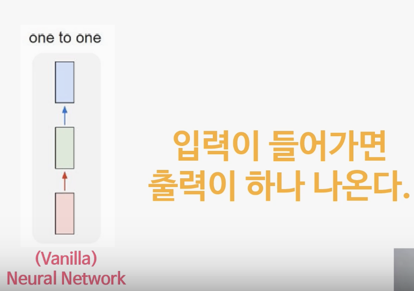
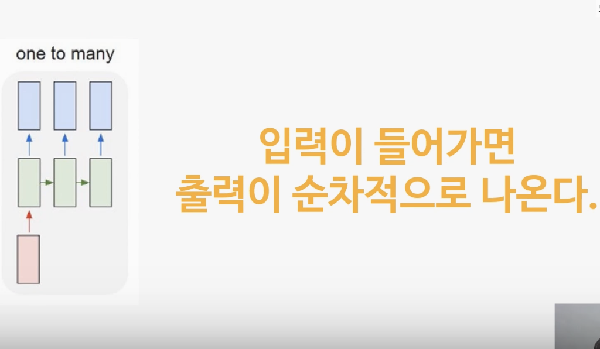
- 입력이 들어가면 출력이 순차적으로 나오는 어플리케이션
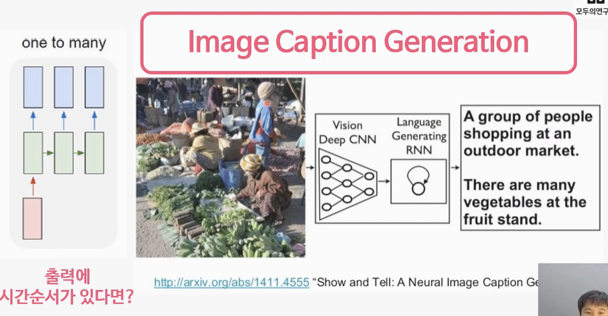
- 입력으로 사진 한장이 들어가고 출력으로 단어의 시퀀스로 나오도록 되어 있음
- 혹은 작사 프로그램(입력은 단어 출력은 가사 같은)도 예시
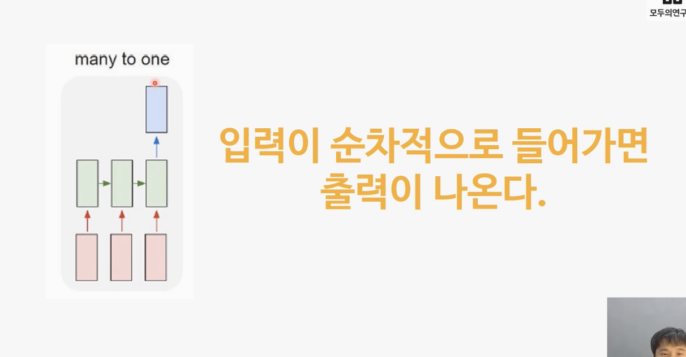
- many to one의 예시는 아래 그림의 감정분석 예시
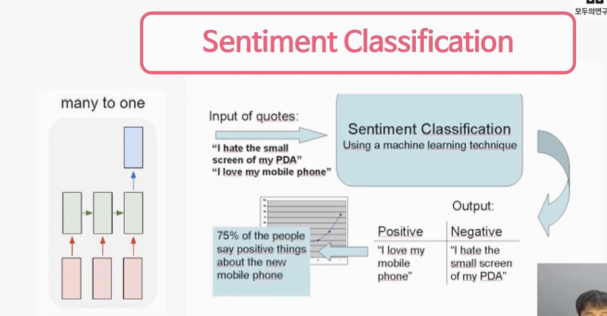
- positive, negative를 판단하는 것이 출력
- 입력은 문장의 단어들이 들어가고, 출력은 문장의 감정이 나옴
- 혹은 입력은 시간에 따라 음악이 흘러나오는 정보를 주면 장르를 구분해주는 것도 가능
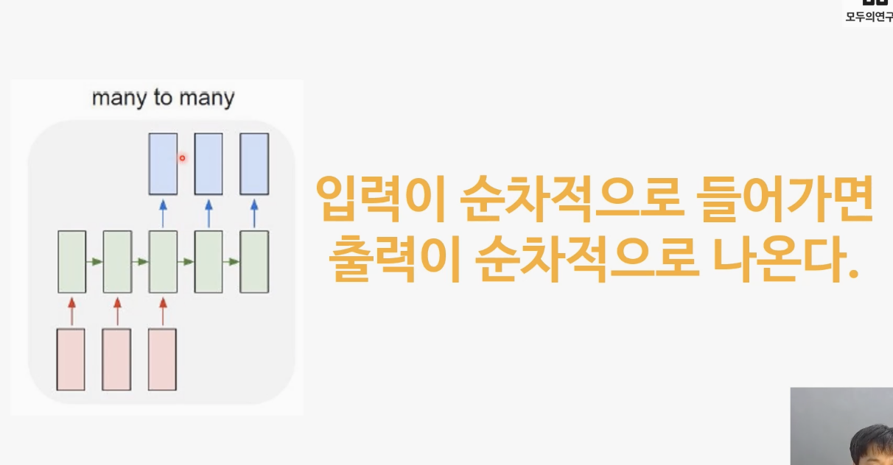
- many to many의 예시는 아래 그림의 기계번역 예시
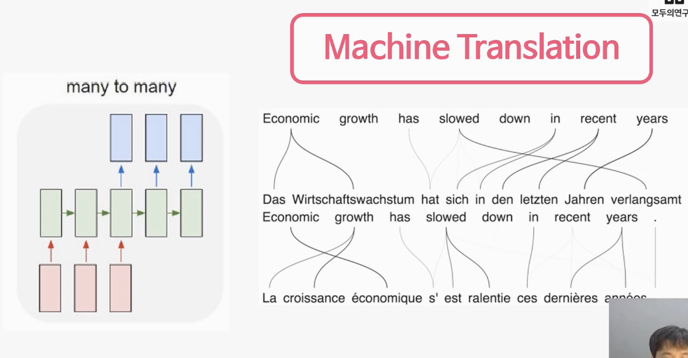
- 입력 또는 출력에 시간 순서가 있는것을 Sequence 라고 함
- 인간은 Sequence를 학습한다. 익숙한 노래를 처음부터 다시 부르면 특정구간이 기억나지만 특정구간을 먼저 불러보라고 하면 시간이 걸림

Q. RNN은 주로 어떤 특성이 있는 문제에 사용되나요?

- 입력 또는 출력에 시간 순서가 있거나, 어떤 문제를 풀기 위하여 입력이나 출력이 여러 개 일때. RNN을 주로 사용합니다.

Q. 영상을 보며 여러분이 생각한 one to many, many to one, many to many의 예시를 각각 적어보세요.

- one to many : 이미지를 입력하면 이미지에 대한 설명을 출력하는 image-captioning 모델 , 하나의 음표를 입력하면 음악을 만들어 내는 음악생성 모델, 분자구조 이미지를 입력하면 smiles 분자식을 내뱉는 모델 등

- many to one : 트위터나, 구매평 등을 입력하여 긍정, 부정을 분류하는 감성분석, 이전 주가 및 외부정보를 활용한 특정 시점의 주식 가격 예측 등

- many to many: 한국어 문장을 영어 문장으로 번역하는 기계번역 모델 , 어떤 단어를 보고 그 단어가 어떤 유형인지를 인식하는 개체명 인식 모델

## 8-2. 순서를 기억하는 인공지능을 만들어보자
- 딥러닝으로 Squence를 학습하는 방법
- Sequence를 입력으로 다 넣어준다면 입력사이즈(및 Neural Network의 파라미터)가 너무 커짐
- 사이즈가 너무 커지면 계산량도 커지고 학습시키기도 어렵고 오버피팅의 우려도 있음
- 입력사이즈를 유지하면서 과거의 입력값들을 반영하는 방법은 RNN
- 과거의 입력값을 잘'버무려' 저장해 놓을 수 있는 Memory를 만들자
- Sequence를 모두 입력으로 주지말고 잘 버무린 Neural Memory만 입력으로 주자

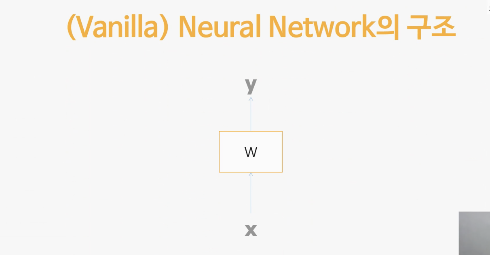
- 일반적은 뉴럴 네트워크는 입력이 들어오면 네트워크웨이트를 통과해서 y를 뽑아냄
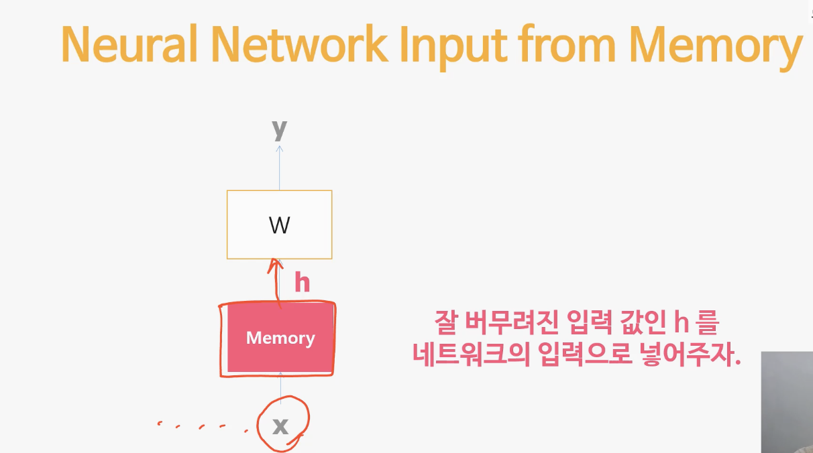
- RNN은 입력이 들어오면 메모리를 통해서 네트워크를 통과해서 y를 뽑아냄
- 바로 입력을 네트워크에 통과하는게 아니라 과거 입력값이 잘 버무려진 h를 넣어줌

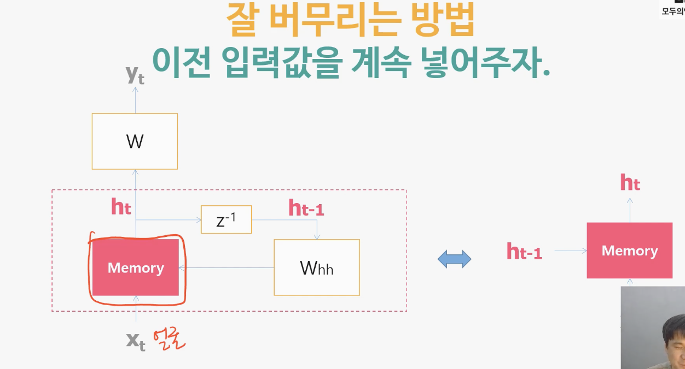
- z^-1은 한 샘플 전의 입력값, ht-1은 한 샘플 전의 메모리, whh가 0.9라고 하면
- '얼굴 찌푸리지 말아요'라는 가사를 예로 들면...
- '얼굴'이라는 단어가 들어오면 메모리에는 '얼굴'이라는 단어가 저장됨
- 두번째 단어는 '찌푸리지', 찌푸리지가 들어온 시점에서 ht-1은 '얼굴'이라는 단어가 저장되어 있음
- whh=0.9라 가정하면 0.9*얼굴+찌푸리지가 메모리에 들어감
- 세번째 단어는 '말아요',
- 말아요가 들어온 시점에서는 0.81얼굴+ 0.9 찌푸리지+ 말아요가 메모리에 들어가 있음
- 현재 입력값과 과거 메모리 값으로 부터 현재 메모리 값을 만들어 냄

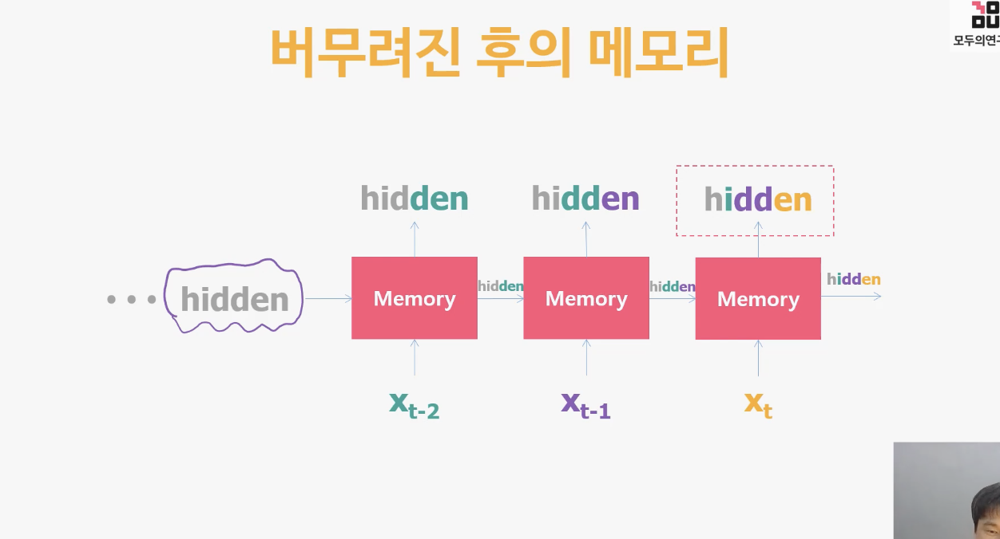
- 회색으로 된 데이터가 있다고 가정
- 입력으로 초록 글자가 들어오면 회색과 초록색이 버무려짐
- 입력으로 보라색이 들어오면 회색 초록색 보라색이 적절히 믹스된 출력을 내보낼 수 있음
- 그다음 노란색 값이 들어오면 다시 4개가 적절히 석인 값이 출력됨
- 가장 최신에 들어온것이 더 많이 남을 수 있음

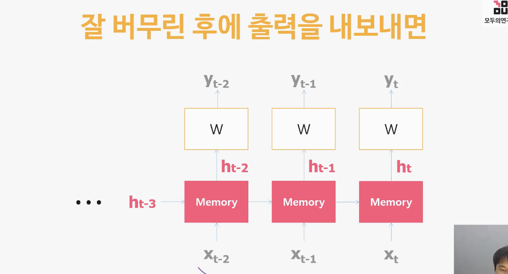
- 잘 버무린 데이터는 뉴럴메모리에 네트웍을 붙여서 출력으로 내보냄
- 입력이 시퀀스로 들어오고 출력이 시퀀스로 나오게 됨

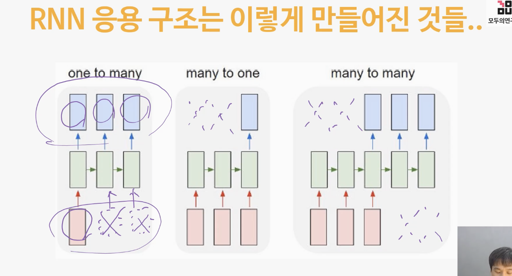
- one to many는 들어온 입력을 몇개 안쓰면 되고 many to one은 출력을 몇개 안쓰면 됨
- RNN을 통해서 입력이 여러개이고 출력이 여러개인 모델을 만들었기 때문에 그것을 활용해서 여러가지 모델을 만들 수 있다

Q. 노래 한곡과 같은 긴 Sequence를 모두 neural network에 입력으로 넣어주게 되면 네트워크 사이즈가 너무 커지게 됩니다. RNN은 어떤 방법을 이용하여 입력사이즈를 일정하게 유지하고 과거의 입력값들을 반영할 수 있게 하나요?

- 과거의 입력 값들을 잘 버무려 저장한 Neural Memory h를 만듭니다.