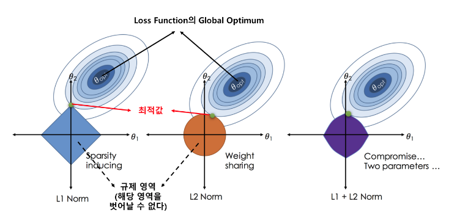
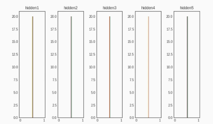
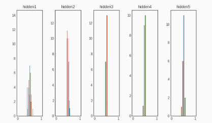
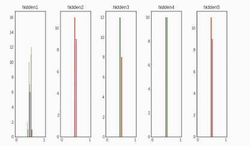
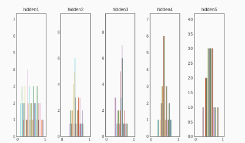
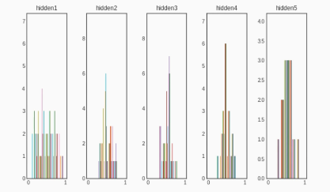
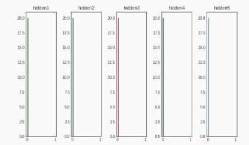
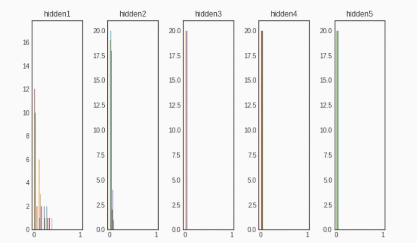
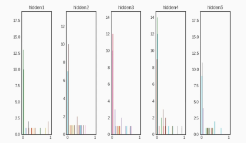
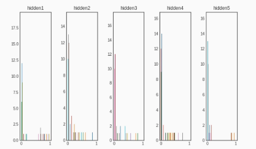

## 딥러닝 한번에 끝내기  

 
 

### 7. 모델 크기 조절과 규제
### 8. 가중치 초기화와 배치 정규화 

 

$$ summary$$

---
### 모델 크기 조절
 
레이어의 유닛수 증가/감소를 통한 모델 전체의 파라미터 수 증가/감소  

레이어의 수 증가를 통해 더 깊은 신경망으로 모델 크기를 증가  

데이터의 규모가 클수록 크고 깊은 모델에서 좋은 성능  

데이터 규모에 비해 모델이 너무 크면 과대적합 발생 가능성 있음

---
##### 모델의 크기가 클수록, 즉 파라미터 수가 많은 신경망일수록 

##### 빠르게 훈련 데이터 모델링이 가능하고, 학습 손실이 낮아짐

- 단점 : 과대적합에는 더욱 민감해지기 때문에 파라미터 수 최적화가 중요

---

딥러닝 알고리즘은 어떤 현상을 가장 잘 설명하기 위한 모델 함수를 찾는 과정  

모델을 찾을때 모델의 예측결과와 실제 결과의 오차를 표현한 함수가 손실함수  

딥러닝 알고리즘은 모델 성능을 높이기 위해 손실함수 최소화 방향 학습 진행

모델을 만들때 대부분 한정된 일부 데이터만 학습데이터 사용  

학습 데이터에만 존재하는 특징(노이즈)들이 과하게 반영되어 손실함수가 필요이상으로 작아지는 경우가 발생, 이를 오버피팅이라 함

---
오버피팅이 발생하는 경우

매개변수가 많고 표현력이 높은 모델  

훈련 데이터가 적음 

오버피팅 완화 기법으로는 가중치 감소와 드롭아웃

** 신경망 모델의 표현력은, 해당 모델이 학습 데이터를 얼마나 정확하게 나타낼 수 있는지를 나타내는 지표입니다. 일반적으로, 표현력이 높은 모델은 더 복잡한 함수를 표현할 수 있으므로, 더 정확한 예측 결과를 가져올 수 있습니다. 하지만, 매개변수 수가 많은 모델에서는 이러한 표현력이 오버피팅을 유발하는 가능성을 높일 수 있습니다. 따라서, 표현력과 오버피팅 사이의 균형을 잡는 것이 중요합니다.

---
가중치 규제란 모델의 손실함수값이 너무 작아지지 않도록 특정한 값(함수)를 추가  

이를 통해 특정 가중치 값이 너무 커져서 일부 특징에 의존하는 현상을 방지하고 데이터의 일반적인 특징을 잘 반영 할 수 있도록 해줌

---
### 규제(Regularization)

가중치 파라미터 값이 커서 과대적합 발생하는 경우를 방지하기 위해 큰 가중치는 큰 규제를 가하는 방법

규제를 통해 가중치의 절댓값을 가능한 작게 만들어 가중치의 모든 원소를 0에 가깝게 만들어 모든 특성이 출력에 주는 영향 최소화  

규제를 통해서 가중치의 분포를 더 균일하게 만들고 네트워크 복잡도에 제한을 두어 가중치가 작은 값을 가지게 함  

규제를 통해 모델이 과대적합 되지 않도록 강제로 제한, 적절한 규제값 중요  

L1,L2 규제 존재 : 손실함수에 큰 가중치에 비용을 추가

---
### L1 규제

L1 규제는 가중치의 절댓값 합에 비례하는 비용을 손실 함수에 추가 하는 방법, 
가중치의 절대값은 L1 노름(norm) 이라고 하며 다음과 같이 표현

$$
||w||_1 = \sum_{i}|w_i|
$$

전체 비용은 다음과 같이 기존의 손실 함수 L에 α를 곱한 L1 규제를 적용하여 계산

$$
Cost = \frac{1}{n}\sum_{i=1}^{n} {L(y_{i}, \hat{y}_{i})} + {\alpha}\sum_{j=1}^{m}|w_j|
$$

$$ 
{L(y_{i}, \hat{y}_{i})} : 손실함수(Loss function) 실제값, 예측값
$$

---
α 값을 이용하여 사용자가 하이퍼파라미터처럼 규제 조절 가능

α 값 증가 : 규제가 강해져 가중치 절댓값의 합을 줄이도록 학습, 가중치가 0인 것들은 제외하여 일반화에 적합
특정 가중치를 0으로 처리하는것이 가능해 중요한 가중치만 남기는 feature selection 가능. 특정가중치를 삭제해 모델의 복잡도를 낮춤
(Cost를 편미분하여 가중치 부호에 따라 가중치 값에 상수만큼 더하거나 뺄수 있음)

α 값 감소 : 규제가 약해져 가중치 증가하여 과대적합 발생 가능성

** Norm 은 벡터의 크기(혹은 길이)를 측정하는 방법(혹은 함수)

---
### L2 규제

L2 규제는 가중치 감쇠라고도 불리며 가중치 제곱에 비례하는 비용을 손실함수의 일정 값에 더하는 방법
- 가중치 크기에 따라 가중치가 큰 값을 더 빠르게 감소
- 가중치 크기에 따라 가중치 패널티 정도가 달라져 가중치가 전반적으로 작아짐(학습효과 상승)
L2규제는 가중치의 제곱에 비례하는 비용을 손실 함수의 일정 값에 더하는 방법 
가중치의 제곱은 L2 노름(norm) 이라고 하며 다음과 같이 표현

$$||\textbf{w}_2|| = \sqrt{\sum_{i=1}^{n}|{w}_i|^2}$$

---

기존의 손실함수 L에서 λ를 곱한 L2 규제를 적용하여 계산

$$Cost = \frac{1}{n}\sum_{i=1}^{n}L(y_i,\hat{y_i})+{\lambda}\sum_{j=1}^{m}w_j^2$$

L2 규제는 가중치의 제곱에 비례하는 비용을 손실 함수의 일정 값을 더하여 과대적합을 방지.   

여기서 λ 값이 크면 가중치 감소가 커지고, 작으면 가하는 규제가 적어짐  

L2 규제는 L1보다 더 Robust한 모델을 생성하므로 많이 사용되는 방법 중 하나

---

L1 규제는 마지막 항에 w를 사용하여 마름모 형태의 규제영역이 생기고, L2 규제는 마지막 항에 w^2을 사용하여 원의 형태로 나타나게 됨

L1,L2 규제를 추가한 손실함수의 최적값은 규제영역내에서 손실함수의 전역최적점과 가장 가까운 지점

α,λ 값이 커질수록 규제영역이 작아짐(손실함수 최적점이 커져서 오버피팅 방지)

---
L1 규제는 불필요한 feature를 사용하지 않도록 유도해서 과적합 문제를 해결

L2규제는 특정 feature에 지나치게 치우치지 않도록 유도해서 과적합 문제를 해결  

L1규제와 L2규제를 모두 사용하는 것을 Elastic Net이라고 함

---
드롭아웃

오버피팅 방지, 쉬운 개념, 사용하기 간편  

학습할때 하용하는 노드의 수를 전체 노드 중 일부만 사용  

학습이 진행되는 동안 무작위로 레이어의 일부 노드를 제외 

테스트에서는 드롭아웃되지 않고 출력 노드를 드롭아웃 비율로 줄여줌

---
예상문제

모델 크기 조절, 규제, 드롭아웃의 목적은 무엇인가요?

모델 크기 조절, 규제, 드롭아웃은 딥러닝에서 모델의 복잡도를 제어하고 일반화 성능을 개선하기 위한 방법입니다.

1. 모델 크기 조절(Model size scaling)
딥러닝 모델의 복잡성은 모델에 포함된 레이어, 뉴런 수, 파라미터 수 등에 크게 의존합니다. 모델의 크기 조절은 모델의 복잡성을 제어하여 모델의 일반화 성능을 개선하는 것을 목적으로 합니다.

---
2. 규제(Regularization)
과적합(overfitting)은 모델이 훈련 데이터를 완벽하게 제시할 때, 새로운 데이터에 대한 일반화 능력이 떨어지는 현상입니다. 이를 방지하기 위해 규제(regularization) 기법을 사용합니다. 규제는 모델을 잘라내거나 수정하는 방법이 아니라, 훈련 동안 모델의 복잡성 비율에 비례하는 Cost Penalty(예측의 비용)를 적용하는 방법입니다. 일반적으로, 규제에는 L1, L2 규제, elastic net 등 여러 가지 종류가 있습니다.

3. 드롭아웃(Dropout)
드롭아웃은 학습 도중 무작위로 일부 뉴런을 끄는 것입니다. 이를 통해 다양한 뉴런들 간의 조합을 학습시키며 결과적으로 가중치가 공유되는 것을 방지합니다. 드롭아웃은 모델의 변경 없이도 복잡도를 제어할 수 있는 강력하면서도 효과적인 기법입니다. 

---
### 가중치 초기화

신경망을 학습할 때 손실 함수의 어느 위치에서 출벌해야 최적해가 있는 곳으로 더 쉽고 빠르게 도달할 수 있을까요?

최적해 근처에서 출발한다면 더 빨리 되겠지만, 최적해가 어디 있는지 모르는 상태에서 어디서 출발하는게 가장 좋을까를 생각해보는 것

---

위와 같은 손실함수 그래프에서 경사하강법을 이용해 따라 내려간다 하더라도 도달하는 최적점이 다르다.
이런 차이점은 초기 가중치가 어떻게 초기화 되었는지에 따라 모델 성능에 영향을 미칠 수 있다는 의미

가중치가 매우 높은 값이나 매우 낮은 값으로 초기화되면 기울기 소실(gradient vanishing)이나, 학습에 오랜 시간이 걸리는 등 모델 학습에 여러 문제가 발생

---

가중치 값이 일부값으로 치우치면 활성화 함수를 통과한 값들도 치우치게 됨  

표현할수 있는 신경망의 수가 적어지는 문제 발생  

가중치 초기값으로 0에 가까운 무작위 값을 사용하더라도 초기값에 따라 모델 성능차이 발생  

모델의 활성화 값이 골고루 분포되는 것이 중요

---
### 선형함수 가중치 초기화
1. 제로초기화
가중치를 제로값으로 초기화하면 각 레이어 가중치 값 분포가 중앙으로 쏠림
가중치가 0일 경우 오차역전파에서 모든 가중치값이 똑같이 갱신되어 학습진행 불가

---
초기값을 모두 0으로 해서는 안되는 이유?

오차역전법에서 모든 가중치의 값이 똑같이 갱신되기 때문

순전파: 입력파의 가중치가 0이기 때문에 두 번째 층의 뉴런에 모두 같은 값이 전달
역전파: 가중치가 모두 똑같이 갱신
가중치를 여러개 갖는 의미를 사라지게 함. 가중치가 고르게 되어버리는 상황을 막으려면 초깃값을 무작위로 설정해야 함

---
2. 정규분포 초기화
정규분포를 따르도록 무작위 값을 초기화, 제로초기화보다 분포 퍼짐
한곳에 치우쳐 있어 여전히 신경망 표현 제한

---
3. 균일분포 초기화
균일분포를 따르는 무작위 값을 초기화한 결과 제로초기화보다 분포 퍼짐
활성화 값이 균일하지 않아 역전파로 전해지는 기울기값이 사라질 수 있음

---
4. Xavier 정규분포 초기화
은닉층의 노드수가 n이라면 표준편차가 $\frac{1}{\sqrt{n}}$ 인 분포로 초기화 진행
비교적 분포가 고르고 레이어마다 표현이 잘되고 있어 더 많은 가중치에 역전파 전달 가능

Xavier 균일 분포 초기화 방범도 마찬가지로 잘 분포함

---
5. He 정규분포 초기화
표준편차가 $\frac{2}{\sqrt{n}}$ 인 분포를 가지도록 초기화
활성화 값 분포가 균일

---
### 비선형 함수 가중치 초기화
1. 제로초기화
가중치를 제로값으로 초기화한 경우 레이어 가중치 분포가 0에 몰림

---
2. 정규분포 초기화
제로초기화 보다 정규분포 초기화의 경우 분포가 퍼져있음
마찬가지로 hidden1 레이어 제외하고 0에 치우침

균일분포 초기화도 마찬가지

---
3. Xavier 정규분포 초기화
Xavier 초기화 방법은 Relu 특성상 0인 값이 많지만, 전체레이어를 보면 어느정도 분포가 퍼져있음

균일분포도 정규분포와 유사한 형태

---
4. He 정규분포 초기화
He 초기화는 일반적으로 비선형 함수에 더 적합하다고 알려져 있으며 시각화된 결과도 어느정도 분포가 고르게 형성됨

He 균일분포도 마찬가지로 유사한 모습

모든 층에서 균일하게 분포. Relu 함수는 음수에서 0이 되므로 나머지를 넓게 사용하기 위해 Xavier 입력값이 2배인 He 초기값을 사용

---
### 배치 정규화

배치 정규화는 학습과정에서 각 배치단위별로 데이터가 다양한 분포를 가지더라도 각 배치별로 평균과 분산을 이용해 정규화
 
---
Internal Covariate Shift(ICS)는 모델이 학습 과정에서 Layer마다 입력 데이터의 분포가 변하는 현상
예를 들어, 아래의 그림 2처럼, 첫 번째 Layer를 통과한 후 출력이자 2번째 Layer의 입력 데이터의 분포는 Gausian 분포를 따르지만, 2번째 Layer의 출력과 3번째 Layer의 출력 데이터의 분포는 한쪽으로 치우치게 나타나는 경우입니다.

---

---
문제점

Layer마다 동일한 학습률(Learning Rate)로 학습할 때, Internal Covariate Shift 현상으로 데이터 분포가 Layer마다 다를 경우 학습 성능이 떨어지는 문제가 발생합니다. 특히, Mini Batch 학습법 사용 시 Batch마다 출력 데이터의 분포가 다르게 나타나고, 이는 전혀 예측 불가한 Gradient를 학습하게 되어 학습의 질이 떨어지는 문제가 발생합니다.

---
가중치의 초기값을 적절히 설정하면 각 층의 활성화 값의 분포가 적당히 퍼지면서 학습이 원활하게 수행

모델에 입력되는 샘플들을 균일하게 만드는 방법

가중치 활성화값이 적당히 퍼지게 강제로 적용시키는 것을 의미

보통 미니배치 단위로 데이터의 평균이 0, 표준편차는 1로 정규화 수행

---

데이터 분포를 정규화 하는 '배치 정규화' 계층을 신경망에 삽입

---
학습자체가 빨리 진행될수 있도록 만들고 학습후 새로운 데이터에 일반화가 잘 될 수 있도록 도와줌

초기값에 의존하지 않아도 되고 과대적합 방지 역할 수행

데이터 전처리 단계에서 진행해도 되지만 정규화가 되어서 레이어에 들어갔다는 보장이 없어 주로 Dense 레이어 이후 활성화 함수 이전 활용

---
데이터 값의 범위 차이가 클 경우, 아래의 그림 1 좌측처럼 비효율적인 최적화 과정을 거치게 됩니다. 데이터 간 편차가 큰 Feature 위주로 학습이 진행되기 때문에 
축 방향 위주로 파라미터가 갱신되며 최적화가 진행됩니다. 반면, 상대적으로 편차가 적은 축 방향의 Feature의 영향력은 상대적으로 무시되는 현상이 발생합니다.

데이터 범위의 차이가 작아지기 때문에, 모델 학습 시 모든 Feature마다 파라미터가 유사한 중요도를 갖고 개선되기 때문에 최적화 과정이 개선되는 효과가 있습니다.

---
### 연습문제

가중치 초기화는 무엇을 하는 것이고 왜 해야하나요?

모델이 학습하기 전 가중치 값을 부여하는 것으로 적절한 가중치 값이 주어지지 않을 경우 가중치 중 활성화되는 부분이 매우 적거나 편향될 수 있기 때문에 필요합니다.

---
가중치 초기화를 왜 해야하는지에 대한 몇 가지 이유는 다음과 같습니다:

학습 속도 향상: 알맞게 초기화된 가중치는 학습 과정에서 수렴 속도를 빠르게 하여 더 빠른 시간 내에 최적의 솔루션을 찾을 수 있게 합니다.

낮은 손실값 시작: 올바른 가중치 초기화는 학습이 시작될 때 손실 함수(Loss function)의 값을 낮출 수 있습니다. 그 결과로, 신경망은 더 빨리 최적의 성능을 발휘할 수 있습니다.

기울기 소실 및 폭주 문제 방지: 기울기 소실(Vanishing gradient) 또는 기울기 폭주(Exploding gradient)와 같은 문제는 신경망 학습 시 발생할 수 있는 큰 문제입니다. 학습을 어렵게 만들거나 발산시키기 때문입니다. 적절한 가중치 초기화 방법을 사용하면 이러한 문제의 발생 가능성을 줄일 수 있습니다.

---

Q. 배치 정규화는 무엇을 하는 것이고 왜 해야하나요?

들어온 데이터를 배치 단위로 평균이 0, 표준편차가 1인 데이터로 조정해주는 일이며 학습 속도 증가와 과대적합을 방지할 수 있습니다.

---

공변량 변화(covariate shift) 억제: 신경망 학습 과정에서 각 층의 입력 분포가 변할 수 있습니다. 이러한 변화로 인해 다음 층에도 영향을 미쳐 네트워크 전체의 학습이 불안정해집니다. 배치 정규화는 이러한 공변량 변화를 줄이기 위해 각 층의 입력 분포를 평균 0, 분산 1로 정규화하고 작은 노이즈를 추가합니다.

학습 속도 향상: 배치 정규화를 사용하면 경사 하강법 등의 최적화 알고리즘의 학습률(learning rate)을 크게 설정할 수 있어 학습 속도가 개선됩니다.

가중치 초기화 영향 감소: 배치 정규화는 가중치 초기화의 영향을 줄여 모델의 안정성을 높입니다. 적절한 가중치 초기화는 여전히 중요하지만, 배치 정규화를 사용하면 초기화가 덜 완벽해도 네트워크가 수렴하는 데 도움을 줍니다.

---

기울기 소실 및 폭주 문제 완화: 배치 정규화는 기울기 소실 및 기울기 폭주 문제를 완화하는 효과를 줍니다. 이는 각 층의 활성화 값 분포가 상대적으로 안정적이기 때문에 역전파 과정에서 소실되거나 폭주하는 기울기를 완화할 수 있습니다.

과적합 억제: 배치 정규화는 모델의 일반화 성능을 개선하는데 도움이 됩니다. 정규화에 사용되는 작은 노이즈는 훈련 데이터에 대한 모델의 종속성을 감소시켜 과적합을 억제하는 효과를 줍니다.
